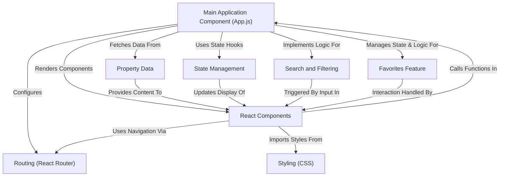

# Getting Started with Create React App

This project was bootstrapped with [Create React App](https://github.com/facebook/create-react-app).

## Available Scripts

In the project directory, you can run:

### `npm start`

Runs the app in the development mode.\
Open [http://localhost:3000](http://localhost:3000) to view it in your browser.

The page will reload when you make changes.\
You may also see any lint errors in the console.

### `npm test`

Launches the test runner in the interactive watch mode.\
See the section about [running tests](https://facebook.github.io/create-react-app/docs/running-tests) for more information.

### `npm run build`

Builds the app for production to the `build` folder.\
It correctly bundles React in production mode and optimizes the build for the best performance.

The build is minified and the filenames include the hashes.\
Your app is ready to be deployed!

See the section about [deployment](https://facebook.github.io/create-react-app/docs/deployment) for more information.

### `npm run eject`

**Note: this is a one-way operation. Once you `eject`, you can't go back!**

If you aren't satisfied with the build tool and configuration choices, you can `eject` at any time. This command will remove the single build dependency from your project.

Instead, it will copy all the configuration files and the transitive dependencies (webpack, Babel, ESLint, etc) right into your project so you have full control over them. All of the commands except `eject` will still work, but they will point to the copied scripts so you can tweak them. At this point you're on your own.

You don't have to ever use `eject`. The curated feature set is suitable for small and middle deployments, and you shouldn't feel obligated to use this feature. However we understand that this tool wouldn't be useful if you couldn't customize it when you are ready for it.

## Learn More

You can learn more in the [Create React App documentation](https://facebook.github.io/create-react-app/docs/getting-started).

To learn React, check out the [React documentation](https://reactjs.org/).

### Code Splitting

This section has moved here: [https://facebook.github.io/create-react-app/docs/code-splitting](https://facebook.github.io/create-react-app/docs/code-splitting)

### Analyzing the Bundle Size

This section has moved here: [https://facebook.github.io/create-react-app/docs/analyzing-the-bundle-size](https://facebook.github.io/create-react-app/docs/analyzing-the-bundle-size)

### Making a Progressive Web App

This section has moved here: [https://facebook.github.io/create-react-app/docs/making-a-progressive-web-app](https://facebook.github.io/create-react-app/docs/making-a-progressive-web-app)

### Advanced Configuration

This section has moved here: [https://facebook.github.io/create-react-app/docs/advanced-configuration](https://facebook.github.io/create-react-app/docs/advanced-configuration)

### Deployment

This section has moved here: [https://facebook.github.io/create-react-app/docs/deployment](https://facebook.github.io/create-react-app/docs/deployment)

### `npm run build` fails to minify

This section has moved here: [https://facebook.github.io/create-react-app/docs/troubleshooting#npm-run-build-fails-to-minify](https://facebook.github.io/create-react-app/docs/troubleshooting#npm-run-build-fails-to-minify)

# Estate-Agent-Web-Application

# Tutorial: Estate-Agent-Web-Application

This project is a web application for browsing **estate properties**.
It allows users to view a list of properties fetched from a *data* file,
*search* and *filter* them by various criteria, and add properties to a
*favorites* list using drag-and-drop. Navigation between the main list and
property details is handled *internally* without full page reloads.


## Visual Overview



## Chapters

1. [Property Data
](01_property_data_.md)
2. [React Components
](02_react_components_.md)
3. [Main Application Component (App.js)
](03_main_application_component__app_js__.md)
4. [State Management
](04_state_management_.md)
5. [Routing (React Router)
](05_routing__react_router__.md)
6. [Search and Filtering
](06_search_and_filtering_.md)
7. [Favorites Feature
](07_favorites_feature_.md)
8. [Styling (CSS)
](08_styling__css__.md)

---

<sub><sup>Generated by [AI Codebase Knowledge Builder](https://github.com/The-Pocket/Tutorial-Codebase-Knowledge).</sup></sub>

# Chapter 1: Property Data

Welcome to the first chapter of our tutorial on building an Estate Agent Web Application!

Think about any website where you look for a house or flat. What's the most important thing you see? Pictures, prices, descriptions, number of bedrooms, and where the property is located, right? All that information is what we call **Property Data**.

### What is Property Data?

In simple terms, Property Data is all the nitty-gritty detail about each property that our web application needs to show you. It's like the detailed description you'd find in a physical brochure for a house, but stored digitally.

Our application needs this data to:
*   Show a list of properties available.
*   Display all the details when you click on a specific property.
*   Allow you to search or filter properties based on things like location or price.

### Where Does the Data Come From?

For our project, instead of connecting to a complex online database right away, we're keeping it simple for learning. We store all our Property Data in a special kind of file called a **JSON file**.

You can find this file in our project at `public/properties.json`.

Think of this JSON file as a digital catalog or a simple spreadsheet containing all the property listings.

### Looking Inside `properties.json`

Let's take a peek at what this file looks like. JSON stands for **JavaScript Object Notation**, and it's a very common way to store and exchange data because it's easy for both humans to read and computers to understand.

Here's a simplified look at our `properties.json` file:

```json
{
    "properties": [
        {
            "id": "prop1",
            "type": "House",
            "bedrooms": 3,
            "price": 750000,
            "description": "Attractive three bedroom semi-detached family home...",
            "location": "Petts Wood Road, Petts Wood, Orpington",
            "image": "../images/house/1.jpg",
            "pictures": [
                "../images/house/1.jpg",
                "../images/house/2.jpeg"
                // ... more image paths
            ],
            "added": {
                "month": "October",
                "day": 12,
                "year": 2022
            }
        },
        {
            "id": "prop2",
            "type": "Flat",
            "bedrooms": 2,
            "price": 399995,
            "description": "Presented in excellent decorative order throughout...",
            "location": "Crofton Road Orpington BR6",
            "image": "../images/flat/1.jpeg",
             "pictures": [
                "../images/flat/1.jpeg",
                "../images/flat/2.jpg"
                // ... more image paths
            ],
            "added": {
                "month": "September",
                "day": 14,
                "year": 2022
            }
        }
        // ... more properties follow
    ]
}
```

*   The outermost part `{}` means it's a JSON **object**.
*   Inside, `"properties": [` means we have a list (an **array** in programming terms) of properties.
*   Each item `{}` inside the `[]` is a single **property object**.
*   Each property object has different pieces of information, like `"id"`, `"type"`, `"bedrooms"`, `"price"`, `"description"`, `"location"`, and even a list of `"pictures"`. Each piece of information is stored as a `key: value` pair (like `"type": "House"`).

This structure is crucial because our application will read this file and use this organized data to show you the properties.

### How the Application Uses Property Data

When you open our estate agent web application, the main part of the app (specifically, the component called `App.js`, which we'll learn about in [Main Application Component (App.js)](03_main_application_component__app_js__.md)) performs a few steps:

1.  It starts up.
2.  It looks for the `public/properties.json` file.
3.  It reads all the data from that file.
4.  It keeps this data ready to be used by other parts of the application that need to display property information.

Here's a simple diagram showing this process:

```mermaid
sequenceDiagram
    participant User: You
    participant Browser: Web Browser
    participant App: Our Web Application (App.js)
    participant DataFile: properties.json

    User->>Browser: Opens application URL
    Browser->>App: Loads the application
    App->>DataFile: Reads property data
    DataFile-->>App: Sends property data
    Note over App: Holds onto the property data
    App->>Browser: Shows initial page (maybe loading)
```

This diagram shows that when the App starts, it fetches the data from the `properties.json` file and keeps it handy. Later chapters will show how the App then uses this data to build the web pages you see.

### Why Use a JSON File?

For a beginner project, using a JSON file is great because:
*   It's simple to understand and edit manually.
*   It's easy for JavaScript (the language our app uses) to read and work with.
*   It allows us to focus on building the user interface and application logic without needing a complex server-side database setup.

Later, in a real-world application, this data would likely come from a proper database, but the concept remains the same: the application needs structured property information to function.

### Conclusion

In this chapter, we learned that **Property Data** is the core information about the listings on our estate agent website. We discovered that this data is stored in a `properties.json` file, which acts like a simple digital catalog. We saw that the data is organized using JSON structure, with each property being an object containing details like type, price, location, and images. Finally, we understood that the main part of our application reads this data when it starts.

Understanding the source and structure of our data is the first crucial step. Now that we know where the information comes from, the next step is to understand how our application uses this data to build what you actually see on the screen.

Let's move on to learn about the building blocks of our application: [React Components](02_react_components_.md).

---

<sub><sup>Generated by [AI Codebase Knowledge Builder](https://github.com/The-Pocket/Tutorial-Codebase-Knowledge).</sup></sub> <sub><sup>**References**: [[1]](https://github.com/Sehandu-Siriwardhana/Estate-Agent-Web-Application/blob/3bf4f49f0b5b9dc4a2d140499cb604a1d733cd13/public/properties.json)</sup></sub>

# Chapter 2: React Components

Welcome back! In the previous chapter, [Chapter 1: Property Data](01_property_data_.md), we learned about where the information for our properties comes from – our `properties.json` file. We saw that this file holds structured data about each listing, like its price, location, and images.

Now, how do we take that data and show it on a webpage that people can actually see and interact with? This is where **React Components** come in!

### What are React Components?

Imagine you're building with LEGO bricks. You don't build the whole house out of one giant, custom-shaped piece. Instead, you use smaller, standardized bricks (like 2x4 bricks, windows, doors, etc.) and put them together.

React Components are very much like these LEGO bricks for building user interfaces (UIs) – the part of the website you see and interact with.

*   They are the **reusable building blocks** of our web application.
*   Each component is a **self-contained piece** responsible for displaying a specific part of the screen and potentially handling interactions within that part.
*   Think of them as specialized widgets: a button component, a search bar component, a list-of-properties component, or even a single property card component.

By breaking down the complex UI into smaller, manageable components, our code becomes:
*   **Easier to understand:** You can focus on one piece at a time.
*   **Easier to maintain:** If something breaks in the property card, you know where to look.
*   **Easier to reuse:** Once you build a button component, you can use it everywhere you need a button without writing the code again.

### Our First Component: The Property Card

Let's look at a concrete example from our Estate Agent application. When you see a list of properties, each individual property is typically displayed in a small box or "card" that shows its picture, price, type, and a short description.

This property card is a perfect example of a component! Why? Because the layout for *each* property card is exactly the same, only the data inside (the specific property's image, price, etc.) changes. We can create a single "Card" component and reuse it for every property we want to display.

You can find the code for this component in the file `src/Card.js`.

### What Does a Component Look Like in Code?

In React, a component is typically a JavaScript function that returns some code that looks like HTML. This HTML-like code is called **JSX**.

Here's a simplified look at our `Card.js` component:

```javascript
import React from 'react'; // Need React library
import './Card.css'; // Styles for this component
import { Link } from 'react-router-dom'; // For navigation

// Define a functional component called Card
// It takes an object called 'props' as input
const Card = (props) => {
    // Inside the component, we use the data passed via props
    const property = props.property; // Access the property data

    // The component returns JSX (HTML-like structure)
    return (
        <div className="propCard">
            
            <div className="propInfo">
                <h2>{property.type} - {property.bedrooms} Bedrooms</h2>
                <p>Price: {property.price}</p>
                {/* ... other property details */}
                <Link to={`/property/${property.id}`}>Details</Link>
                <button>Favorite</button>
            </div>
        </div>
    );
}

export default Card; // Make the component available for others to use
```

**Explanation:**

1.  `import React from 'react';`: Every file using React JSX needs this.
2.  `const Card = (props) => { ... }`: This defines our component as a JavaScript function named `Card`. The name of the component should start with an uppercase letter (convention in React).
3.  `(props)`: This function accepts an argument, conventionally named `props`. This is how data is passed *into* the component from the outside.
4.  `return (...)`: The function returns JSX, which describes what the component should look like on the screen.
5.  `<div className="propCard">`: This looks like HTML, but it's JSX. `className` is used instead of `class` because `class` is a reserved word in JavaScript.
6.  `{property.image}`, `{property.type}`, etc.: Inside the JSX, curly braces `{}` are used to embed JavaScript expressions. Here, we're accessing the `property` object that was passed in via `props` and displaying its `image`, `type`, and `bedrooms`. This is how the component uses the data it receives to render dynamically.
7.  `export default Card;`: This line makes the `Card` component available to be used in other files (like `App.js`).

### Passing Data with Props

The `props` object is fundamental to how components work. It stands for "properties."

Imagine our LEGO brick needs to be painted a certain color. You'd give it the color property. Similarly, a React component receives data or configuration from its "parent" component through `props`.

In our `Card` component example, when we use the `Card` component elsewhere (say, in a component that displays a list of properties), we pass the specific property data *to* it using props:

```javascript
// Imagine this code is in another file, like a List component
import Card from './Card'; // Import the Card component

// ... inside the List component's render function ...

const propertyData = {
    id: "prop1",
    type: "House",
    bedrooms: 3,
    price: 750000,
    // ... etc. from properties.json
};

// Here we use the Card component and pass the property data as a 'property' prop
<Card property={propertyData} />

// We could use it again for another property:
const anotherPropertyData = {
    id: "prop2",
    type: "Flat",
    bedrooms: 2,
    price: 399995,
    // ... etc.
};

<Card property={anotherPropertyData} />
```

In the code above, the `property={propertyData}` part is where we pass the data. We're giving the `Card` component a "prop" named `property`, and its value is the `propertyData` object we got from our JSON file (or wherever the parent component got it).

Inside the `Card` component, we then access this data using `props.property`.

**Think of props as inputs to your component function.** They are read-only – a component should never change the data it receives via props.

### Other Components in Our Project

Our project uses many components besides the `Card`:

*   `Header.js`: The component for the top bar of the application, containing the logo, title, and search input. It receives functions as props to handle search input (`onBasicSearch`) and showing the advanced search (`toggleAdvSearch`).
*   `AdvSearch.js`: The component for the advanced search form. It receives functions as props (`onChange`, `onSearch`) to handle input changes and triggering the search.
*   `Favourites.js`: The component displaying the list of favorite properties. It receives the list of favorite properties as a prop (`favourites`) and functions to handle dropping properties onto the list (`onDrop`) and removing items (`onRemoveItem`).
*   `CardDetails.js`: A component to show the detailed view of a *single* property when you click on it. It needs the specific property's `id` (received via routing, which we'll cover in [Routing (React Router)](05_routing__react_router__.md)) and then fetches its data.

Each of these components is responsible for rendering a specific part of the UI and handling related interactions, receiving necessary data or functions via props.

### How Components Work Together (Simplified)

Let's see how a parent component might use the `Card` component, using our property data concept from Chapter 1.

```mermaid
sequenceDiagram
    participant App: Main Application Component
    participant PropertyData: Data from properties.json
    participant CardComponent: Card Component

    App->>PropertyData: Read all properties
    PropertyData-->>App: List of properties ([prop1, prop2, ...])
    Note over App: Loop through each property
    App->>CardComponent: Render Card for prop1, passing prop1 data as 'property' prop
    CardComponent-->>App: Returns JSX for prop1 Card
    App->>CardComponent: Render Card for prop2, passing prop2 data as 'property' prop
    CardComponent-->>App: Returns JSX for prop2 Card
    Note over App: Combines all Card JSX and other UI elements
    App-->>Browser: Sends final HTML/UI to browser
```

This diagram shows that the main `App` component (which we'll discuss in the next chapter) reads the data. Then, for *each* property it finds, it tells React to render a `Card` component and gives that component the specific property's data using props. The `Card` component uses that data to create its specific HTML structure, and `App` puts all these pieces together to form the final page.

### Conclusion

In this chapter, we learned that **React Components** are the fundamental building blocks of our user interface. They help us break down the complex task of building a website into smaller, manageable, and reusable pieces, much like using LEGO bricks. We saw that components are typically JavaScript functions returning JSX, and they receive data and configuration from their parent components through an object called **props**. We looked at the `Card` component as a key example of how data from `properties.json` is passed via props and used to display dynamic content.

Now that we understand what components are and how they receive data, the next logical step is to see how these components are organized and put together to form the entire application page.

Let's move on to learn about the central component that often orchestrates everything: [Main Application Component (App.js)](03_main_application_component__app_js__.md).

---

<sub><sup>Generated by [AI Codebase Knowledge Builder](https://github.com/The-Pocket/Tutorial-Codebase-Knowledge).</sup></sub> <sub><sup>**References**: [[1]](https://github.com/Sehandu-Siriwardhana/Estate-Agent-Web-Application/blob/3bf4f49f0b5b9dc4a2d140499cb604a1d733cd13/src/AdvSearch.js), [[2]](https://github.com/Sehandu-Siriwardhana/Estate-Agent-Web-Application/blob/3bf4f49f0b5b9dc4a2d140499cb604a1d733cd13/src/Card.js), [[3]](https://github.com/Sehandu-Siriwardhana/Estate-Agent-Web-Application/blob/3bf4f49f0b5b9dc4a2d140499cb604a1d733cd13/src/CardDetails.js), [[4]](https://github.com/Sehandu-Siriwardhana/Estate-Agent-Web-Application/blob/3bf4f49f0b5b9dc4a2d140499cb604a1d733cd13/src/Favourites.js), [[5]](https://github.com/Sehandu-Siriwardhana/Estate-Agent-Web-Application/blob/3bf4f49f0b5b9dc4a2d140499cb604a1d733cd13/src/Header.js)</sup></sub>

# Chapter 3: Main Application Component (App.js)

Welcome back! In the last chapter, [Chapter 2: React Components](02_react_components_.md), we learned that our web application is built from reusable building blocks called **React Components**. We saw how a component like the `Card` uses data passed to it via `props` to display information dynamically.

But who decides *which* components to show, *when* to show them, and *what data* to give them? How does the `Header` component know what to do when you type into the search bar? How does the application know to fetch the initial list of properties in the first place?

This is where the **Main Application Component**, usually named `App.js`, comes in.

### The Control Center: What is App.js?

Think of `App.js` as the **central command center** or the **main conductor** of your entire application orchestra. It's the top-level component that holds everything together.

Here's what `App.js` is responsible for in our Estate Agent application:

1.  **Fetching Initial Data:** It's the component that first goes and reads the property data from our `properties.json` file when the application starts.
2.  **Managing Important Information (State):** It keeps track of crucial pieces of information that change while the user interacts with the app, like:
    *   The full list of properties.
    *   What the user has typed into the search bar.
    *   Which properties the user has marked as favorites.
    *   Whether the advanced search section should be visible.
    This changing information is called **"state"** in React, and managing it is a key role for `App.js`. We'll dive deeper into this in [Chapter 4: State Management](04_state_management_.md).
3.  **Setting Up Navigation (Routing):** It decides *what* the user sees based on the web address (URL) in the browser. For example, it knows to show the list of properties on the homepage (`/`) and the details of a single property when you go to an address like (`/property/prop1`). This is handled using a library called React Router, which we'll cover in [Chapter 5: Routing (React Router)](05_routing__react_router__.md).
4.  **Orchestrating Other Components:** It's responsible for rendering (`showing`) other components like `Header`, `AdvSearch`, `Card`, `CardDetails`, and `Favourites`. Crucially, it passes the necessary data and functions (`props`) down to these components so they know what to display and how to handle user interactions.

In short, `App.js` connects all the pieces, manages the core data flow, and determines the overall structure and behavior of the application.

### How App.js Fetches Data

One of the first things `App.js` does is get the property data. We learned in [Chapter 1: Property Data](01_property_data_.md) that this data comes from `public/properties.json`.

In React, we often use a special tool called `useEffect` to perform actions when a component "mounts" (appears on the screen) or when certain things change. Fetching data when the app starts is a perfect job for `useEffect`.

Look at this simplified snippet from `src/App.js`:

```javascript
import React, { useState, useEffect } from 'react'; // We need useState and useEffect

const App = () => {
    const [properties, setProperties] = useState([]); // State to hold the properties

    // useEffect runs after the component is rendered
    useEffect(() => {
        // Fetch data from the JSON file
        fetch('/properties.json')
            .then(response => response.json()) // Get the JSON from the response
            .then(data => {
                console.log("Data fetched:", data.properties.length, "properties");
                setProperties(data.properties); // Update the 'properties' state
            })
            .catch(error => console.error("Error fetching properties:", error)); // Handle errors
    }, []); // The empty array [] means this effect runs only ONCE, when the component mounts

    // The rest of the component's logic and JSX will go here...
    // ...
}

export default App;
```

**Explanation:**

1.  `import React, { useState, useEffect } from 'react';`: We import `useState` and `useEffect` from the React library.
2.  `const [properties, setProperties] = useState([]);`: This line sets up a piece of state named `properties`. It starts as an empty array `[]`. `setProperties` is a function we use later to update this state. (More on `useState` in the next chapter!).
3.  `useEffect(() => { ... }, []);`: This is the `useEffect` hook. The function inside (`() => { ... }`) will run.
    *   `fetch('/properties.json')`: This is a standard JavaScript way to request a file (or data from a web address). It asks for the `properties.json` file.
    *   `.then(response => response.json())`: When the file is successfully fetched, this part processes the response to get the data as a JavaScript object.
    *   `.then(data => setProperties(data.properties))`: Once the data is ready, we take the `properties` array *from* the fetched data (`data.properties`) and use `setProperties` to update the `properties` state variable.
    *   `.catch(...)`: This handles potential errors during the fetch.
    *   The empty array `[]` at the end is crucial! It tells React: "Run this effect *only once* after the initial render." This is exactly what we want for fetching data when the app starts.
4.  `setProperties(data.properties)`: When this line runs, React sees that the `properties` state has changed. It then re-renders the `App` component (and any components that rely on the `properties` state), now with the actual property data loaded!

This simple `useEffect` ensures that as soon as our `App` component loads, it goes and gets the data it needs to show you the properties.

### Managing Application State

Besides the property data, `App.js` manages other pieces of "state" that change as the user interacts:

*   `search`: What text is currently in the basic search box.
*   `AdvSearchCriteria`: An object holding values typed into the advanced search fields (like `{ type: 'House', bedrooms: '3' }`).
*   `showAdvSearch`: A true/false value indicating if the advanced search form is visible.
*   `favourites`: An array holding the properties the user has added to their favorites list.

Each of these is managed using the `useState` hook, similar to how `properties` is managed:

```javascript
// Inside the App component function...
const [search, setSearchTerm] = useState('');
const [AdvSearchCriteria, setAdvSearchCriteria] = useState({});
const [showAdvSearch, setShowAdvSearch] = useState(false);
const [favourites, setfavourites] = useState([]);
// ... and the properties state we saw earlier
```

Why does `App.js` hold this state? Because this information needs to be available to *multiple* parts of the application:

*   The `Header` component needs to know the `search` term.
*   The list of `Card` components needs the `properties` (or filtered properties) to display.
*   The `Favourites` component needs the `favourites` list.
*   The `AdvSearch` component needs the `AdvSearchCriteria` and a way to update it.

By keeping this central information in the top-level `App` component, `App.js` can then pass it down to the components that need it via `props`.

### Orchestrating Components and Passing Props

`App.js` is where you'll see the main structure of the application defined using JSX, including all the different components being used.

Look at the main `return` part of the `App` component (simplified):

```javascript
return (
    <Router> {/* This sets up routing */}
        <Routes> {/* This defines different possible views */}
            <Route path="/" element={/* This is the homepage view */}
                <div className="App">
                    {/* The Header component */}
                    <Header 
                        onBasicSearch={handleBasicSearch} // Pass a function to Header
                        toggleAdvSearch={toggleAdvSearch} // Pass another function
                    />

                    <div className="app-container">
                        <div className="propView">
                            {/* Conditionally show AdvSearch */}
                            {showAdvSearch && <AdvSearch onChange={handleAdvSearchChange} />}

                            <div className="propList">
                                {/* Loop through filtered properties and render a Card for each */}
                                {filteredProperties.map(property => (
                                    <Card 
                                        key={property.id} 
                                        property={property} // Pass the property data
                                        onDragStart={handleDragStart} // Pass drag function
                                        onAddToFavorites={handleFavorite} // Pass favorite function
                                    />
                                ))}
                            </div>
                        </div>

                        <div className="favCart">
                            {/* The Favourites component */}
                            <Favourites 
                                onDrop={handleDrop} 
                                favourites={favourites} // Pass the list of favorites
                                onRemoveItem={handleRemoveFavorite} 
                                // ... other favorite related props
                            />
                        </div>
                    </div>
                </div>
            } />

            {/* This is the route for showing single property details */}
            <Route path="/property/:id" element={<CardDetails />} />
        </Routes>
    </Router>
);
```

**Explanation:**

1.  `<Router>` and `<Routes>`: These are parts of `react-router-dom`. `App.js` wraps everything in `<Router>` to enable routing. `<Routes>` is where we define the different possible "pages" based on the URL.
2.  `<Route path="/" ...>`: This `<Route>` says "when the path is `/` (the homepage), show the content inside the `element` prop."
3.  `<div className="App"> ... </div>`: This is the main layout container for the homepage.
4.  `<Header ... />`: Here, `App.js` renders the `Header` component.
    *   `onBasicSearch={handleBasicSearch}`: This is a *prop*. `App.js` defines a function called `handleBasicSearch` (which updates the `search` state) and passes that function *down* to the `Header`. The `Header` component can then call this function when the user types in the search box or clicks a search button. This is how child components communicate *up* to the parent (`App.js`) to trigger changes in state.
    *   `toggleAdvSearch={toggleAdvSearch}`: Similar to `onBasicSearch`, a function to toggle the advanced search visibility is passed down.
5.  `{showAdvSearch && <AdvSearch ... />}`: This is conditional rendering. If `showAdvSearch` is `true`, the `AdvSearch` component is rendered. If `false`, it's not. `App.js` controls the visibility based on its state.
    *   `onChange={handleAdvSearchChange}`: A function to update the `AdvSearchCriteria` state is passed to `AdvSearch`.
6.  `{filteredProperties.map(property => (...))}`: This is a common pattern in React. `App.js` takes the list of properties (`filteredProperties` is the state variable `properties` after applying search/filters) and uses the `.map()` function to create a `Card` component *for each* property in the list.
    *   `<Card key={property.id} property={property} ... />`: For each `Card`, `App.js` passes the specific `property` data as a prop named `property`. It also passes functions like `onDragStart` and `onAddToFavorites` so the `Card` component can trigger actions in `App.js` when the user interacts with a card (like dragging it or clicking a favorite button if one existed there).
7.  `<Favourites ... />`: The `Favourites` component is rendered.
    *   `favourites={favourites}`: The current list of favorite properties (stored in `App.js`'s state) is passed down to the `Favourites` component so it can display them.
    *   `onDrop={handleDrop}`, `onRemoveItem={handleRemoveFavorite}`: Functions to handle adding/removing favorites are passed down.
8.  `<Route path="/property/:id" element={<CardDetails />} />`: This defines another route. When the URL matches `/property/` followed by an ID (like `/property/prop1`), React Router will render the `CardDetails` component instead of the homepage structure. (We'll explore `CardDetails` and routing more in future chapters).

This structure shows how `App.js` acts as the central organizer, managing state, rendering child components, and passing data and functions down through props to control their behavior and appearance.

### App.js Workflow (Simplified)

Here's a simple flow of what happens in `App.js` when the application starts:

```mermaid
sequenceDiagram
    participant Browser
    participant index.js
    participant App: Main Application Component
    participant properties.json: Data File

    Browser->>index.js: Load application
    index.js->>App: Render App component
    App->>properties.json: Fetch data (useEffect)
    properties.json-->>App: Sends property data
    App->>App: Update 'properties' state
    Note over App: State changes, App re-renders
    App->>Browser: Send initial UI (Header, empty list, Favorites)
    Note over App: Filter properties based on search/adv search state (initially empty)
    App->>App: Map filtered properties to Card components
    App->>App: Pass props (data, functions) to Header, AdvSearch, Cards, Favourites
    App-->>Browser: Send updated UI (Header, rendered Cards, Favourites)
```

This diagram illustrates that `App` fetches data, holds onto it in its state, and then renders the appropriate child components (`Header`, `Card`s, `Favourites`, etc.), feeding them the necessary data (`props`) derived from its state.

### Conclusion

In this chapter, we've explored the crucial role of the **Main Application Component (`App.js`)**. We learned that it's the central hub responsible for fetching initial data, managing key pieces of application information using **state**, setting up the rules for **navigation (routing)**, and orchestrating all the other **React Components** by rendering them and passing data and functions through **props**. It's the conductor that makes sure the entire application works together harmoniously.

Now that we understand *where* the central data and state live, the next logical step is to look closer at *how* this state is managed and updated in React.

Let's move on to [Chapter 4: State Management](04_state_management_.md).

---

<sub><sup>Generated by [AI Codebase Knowledge Builder](https://github.com/The-Pocket/Tutorial-Codebase-Knowledge).</sup></sub> <sub><sup>**References**: [[1]](https://github.com/Sehandu-Siriwardhana/Estate-Agent-Web-Application/blob/3bf4f49f0b5b9dc4a2d140499cb604a1d733cd13/src/App.css), [[2]](https://github.com/Sehandu-Siriwardhana/Estate-Agent-Web-Application/blob/3bf4f49f0b5b9dc4a2d140499cb604a1d733cd13/src/App.js), [[3]](https://github.com/Sehandu-Siriwardhana/Estate-Agent-Web-Application/blob/3bf4f49f0b5b9dc4a2d140499cb604a1d733cd13/src/index.js)</sup></sub>

# Chapter 4: State Management

Welcome back! In the last chapter, [Chapter 3: Main Application Component (App.js)](03_main_application_component__app_js__.md), we saw that `App.js` acts as the central hub for our application. It fetches the initial property data and is responsible for pulling together all the different components like `Header`, `Card`, and `Favourites`.

But a web application isn't static like a printed brochure. It's dynamic! You interact with it: you type in a search box, click a button, drag a property to favourites. When you do these things, the information the application needs to display often changes.

For example, when you type "House" into the search bar, the list of properties shown should change to only include houses. When you add a property to favourites, the favourites list should update immediately.

How does the application *remember* what you've typed? How does it *know* which properties are currently in the favourites list? How does it ensure that when this information changes, the parts of the screen that display this information automatically update?

This is where the concept of **State Management** comes in.

### What is State Management?

In a web application, "state" refers to any piece of information that:
1.  Can **change** over time while the application is running.
2.  Is **important** enough that when it changes, the user interface (what you see on the screen) might need to update.

State management is the process of organizing and handling these changing pieces of information in a way that makes it easy to:
*   Store the current values of the state.
*   Update the state based on user actions or data loading.
*   Make sure the parts of the UI that depend on that state automatically re-render (update) to show the latest information.

Think of the application's state as its "memory" of what's currently going on and what data it's working with.

In our Estate Agent app, key pieces of state managed primarily within `App.js` include:

*   The full list of properties loaded from `properties.json`.
*   The text the user has typed into the basic search bar.
*   The values selected or typed into the advanced search fields.
*   Whether the advanced search section is currently visible or hidden.
*   The list of properties the user has added to their favourites.

### React's `useState` Hook

React provides a built-in tool specifically for managing state within functional components (like our `App` component, `Header`, `AdvSearch`, etc.). This tool is called the **`useState` Hook**.

Hooks are special functions that let you "hook into" React features (like state) from your functional components. `useState` is the most fundamental one for managing state.

Here's the basic idea: when you call `useState` in a component, you're asking React to give that component a piece of state to remember.

#### How `useState` Works

You use `useState` like this:

```javascript
import React, { useState } from 'react'; // 1. Import useState

const MyComponent = () => {
  // 2. Declare a state variable
  const [currentValue, setCurrentValue] = useState(initialValue); 

  // ... rest of the component logic and JSX
}
```

Let's break down that important line: `const [currentValue, setCurrentValue] = useState(initialValue);`

1.  **`useState(initialValue)`**: You call the `useState` hook, passing it the `initialValue` you want this piece of state to have when the component first starts up. This could be an empty string (`''`), an empty array (`[]`), a number (`0`), a boolean (`true` or `false`), or an object (`{}`).
2.  **`const [...] =`**: `useState` doesn't return a single value; it returns an array containing exactly two things. We use array destructuring (the `[...] =`) to give names to these two things.
3.  **`currentValue`**: The *first* item in the array is the **current value** of this piece of state. You use this variable in your component's JSX or logic to read the state.
4.  **`setCurrentValue`**: The *second* item in the array is a **function** that you *must* call to update this state. This is often called the "setter" function.

**Crucially:** When you call `setCurrentValue(newValue)`, you are not just changing the `currentValue` variable directly. You are telling React: "Hey, this state needs to change to `newValue`. Please re-render this component (and potentially its children) with this new state value."

React then updates its internal record of this component's state, and the component function runs again. This time, `useState` will return the *new* value you just set.

### Using `useState` in `App.js`

Let's look at how `App.js` uses `useState` to manage its important pieces of information, based on the code from the previous chapter.

Here are the state declarations at the top of the `App` component function:

```javascript
import React, { useState, useEffect } from 'react'; // Need useState and useEffect

const App = () => {
    // State to hold the full list of properties
    const [properties, setProperties] = useState([]); 

    // State for the text in the basic search bar
    const [search, setSearchTerm] = useState(''); 

    // State for the advanced search criteria (e.g., { type: 'House', bedrooms: '3' })
    const [AdvSearchCriteria, setAdvSearchCriteria] = useState({}); 

    // State to control if the advanced search form is visible
    const [showAdvSearch, setShowAdvSearch] = useState(false); 

    // State to hold the list of properties the user has favourited
    const [favourites, setfavourites] = useState([]); 

    // ... rest of the App component
}
```

**Explanation:**

*   `const [properties, setProperties] = useState([]);`: Sets up `properties` to hold the array of all property objects. It starts as an empty array `[]` because we haven't fetched the data yet. `setProperties` is the function we'll use to fill this array later (when the data loads).
*   `const [search, setSearchTerm] = useState('');`: Sets up `search` to hold the text from the basic search input. It starts as an empty string `''`. `setSearchTerm` is the function called whenever the user types in the search box.
*   `const [AdvSearchCriteria, setAdvSearchCriteria] = useState({});`: Sets up `AdvSearchCriteria` to hold the values from the advanced search form. It starts as an empty object `{}`. `setAdvSearchCriteria` is called when the user types in those fields.
*   `const [showAdvSearch, setShowAdvSearch] = useState(false);`: Sets up `showAdvSearch` to track whether the advanced search section is visible. It starts as `false` (hidden). `setShowAdvSearch` is called when the user clicks the "Advanced Search" button.
*   `const [favourites, setfavourites] = useState([]);`: Sets up `favourites` to hold the array of favorited properties. It starts as an empty array `[]`. `setfavourites` is called when a property is added or removed from favourites.

Notice how each piece of state has its own `useState` call, providing a specific part of the application's memory.

### How State Changes Trigger UI Updates

This is the most powerful part of using state with React: when you use the "setter" function (like `setSearchTerm` or `setfavourites`), React automatically knows that the component's state has changed and that it needs to update what's shown on the screen.

Consider the search example:

1.  The `search` state starts as `''`.
2.  The `Header` component (which received the `search` state and the `setSearchTerm` function as `props` from `App.js`, as discussed in [Chapter 3: Main Application Component (App.js)](03_main_application_component__app_js__.md)) handles user input.
3.  When the user types "House" into the search box, the `Header` component calls the `setSearchTerm('House')` function that was passed down.
4.  React sees that the `search` state in the `App` component is being updated from `''` to `'House'`.
5.  React tells the `App` component to re-render.
6.  The `App` component function runs again from top to bottom.
7.  This time, when `useState('')` for search is called, it returns the *new* value, which is `'House'`. The `search` variable inside the `App` function is now `'House'`.
8.  The `App` component then calculates the `filteredProperties` based on the *current* `search` value (`'House'`).
9.  The `.map()` function then creates `Card` components only for the properties in the `filteredProperties` list.
10. React updates the actual web page in the browser to show only the cards for houses.

All of this happens automatically because you updated the state using the setter function!

Here's a simplified flow when state changes:

```mermaid
sequenceDiagram
    participant User
    participant Component: A React Component (e.g., Header)
    participant App: App.js Component
    participant React: React Library
    participant Browser: Web Page

    User->>Component: Performs action (e.g., types in search)
    Component->>App: Calls setter function received via props (e.g., setSearchTerm('House'))
    App->>React: Calls its state setter function
    React->>React: Updates internal state value
    React-->>App: Schedules App component to re-render
    Note over React: Wait for next update cycle
    React->>App: Rerenders App component function
    App->>React: Calls useState (receives NEW state value)
    App->>App: Calculates new data based on state (e.g., filters properties)
    App->>App: Determines which child components to render/update (e.g., Card list)
    App->>React: Returns updated JSX structure
    React->>Browser: Updates the actual HTML/DOM to match the new JSX
    Browser-->>User: User sees updated UI (e.g., filtered list)
```

This diagram shows that user actions in a child component (`Header`) trigger a state update in the parent (`App`) by calling a function passed down via props. Updating the state (`setSearchTerm`) is the signal to React that the UI needs to change, prompting a re-render of the `App` component, which then calculates the new UI structure and tells React to update the browser.

### Why Not Just Use Regular Variables?

You might wonder, why go through this `useState` process? Why not just declare a regular JavaScript variable inside the component, like `let currentSearch = ''`, and update it directly?

There are two main reasons:

1.  **Variables Reset on Re-render:** When a React component re-renders (which happens frequently when state changes), the component function runs again from the start. Any regular variables declared inside the function are re-initialized. So, `let currentSearch = ''` would always reset the search term back to an empty string every time the component updates, losing the user's input! `useState`, however, preserves the state value between renders.
2.  **Changing Variables Doesn't Trigger UI Updates:** Even if the variable's value were somehow preserved, simply changing a regular variable (`currentSearch = 'House'`) *does not* tell React that the UI needs to be updated. React only knows to re-render when its special state setter functions (`setSearchTerm`, `setfavourites`, etc.) are called.

Using `useState` provides both the memory persistence and the trigger for React to update the user interface when the state changes.

### Updating State Based on Previous State

Sometimes, the new state value depends on the *previous* state value. For example, when you add a property to favourites, you want the *new* `favourites` array to be the *old* `favourites` array *plus* the new property.

The setter functions provided by `useState` can accept a function as an argument. This function receives the *previous* state value and should return the *new* state value. This is the safest way to update state when the new state depends on the old state, especially in complex scenarios.

Look at the `handleFavorite` function in `App.js`:

```javascript
// Handle adding a property to favorites
const handleFavorite = (property) => {
  // Check if the property is already in favourites
  if (!favourites.some(fav => fav.id === property.id)) {
      // Use the functional update form of setfavourites
      setfavourites(prevfavourites => [...prevfavourites, property]);
  }
};
```

Here, `setfavourites(prevfavourites => [...prevfavourites, property]);` uses the functional update form.
*   `prevfavourites` is guaranteed by React to be the *most recent* value of the `favourites` state when this update is processed.
*   `[...prevfavourites, property]` uses the spread syntax (`...`) to create a *new* array that contains all the items from the `prevfavourites` array *plus* the new `property`. We return this new array.

Creating a *new* array is important in React state updates for arrays and objects. You shouldn't directly modify the existing state array or object (e.g., `favourites.push(property)` is generally discouraged for state updates). Always create a new one or a copy.

### Conclusion

In this chapter, we've tackled the essential concept of **State Management** in React applications. We learned that "state" is the dynamic, changing information our app needs to remember, and managing it is crucial for updating the user interface.

We discovered React's built-in tool for managing state in functional components: the **`useState` Hook**. We saw how `useState` gives us a state variable and a setter function, and how calling the setter function is the way to tell React to update the state and re-render the component. We looked at how `App.js` uses `useState` to manage key pieces of information like the property list, search terms, and favourites.

Understanding state is fundamental to building interactive React applications. Now that we know how `App.js` manages data and state, the next step is to see how it decides *what* components to show based on the web address in the browser.

Let's move on to [Chapter 5: Routing (React Router)](05_routing__react_router_.md).

---

<sub><sup>Generated by [AI Codebase Knowledge Builder](https://github.com/The-Pocket/Tutorial-Codebase-Knowledge).</sup></sub> <sub><sup>**References**: [[1]](https://github.com/Sehandu-Siriwardhana/Estate-Agent-Web-Application/blob/3bf4f49f0b5b9dc4a2d140499cb604a1d733cd13/src/App.js)</sup></sub>

# Chapter 5: Routing (React Router)

Welcome back! In the previous chapter, [Chapter 4: State Management](04_state_management_.md), we learned how our `App.js` component keeps track of important, changing information using **state** and the `useState` hook. This state helps our application remember things like the list of properties, what you've searched for, and your favourite items, and automatically update the parts of the screen that need to show this changing data.

So far, we've primarily focused on building a single view: the main page showing the list of properties, search bars, and favourites. But what happens when you want to click on a specific property to see *more* details? You expect the entire page content to change, showing only the information for that one property. And you expect the web address (URL) in your browser's address bar to change too, maybe to something like `/property/prop1`.

How do we make our single-page application behave like a traditional multi-page website, where different URLs show different content, but without the browser having to load an entirely new HTML file from the server every time?

This is where **Routing** comes in, and for React applications, a very popular tool for this is the **React Router** library.

### What is Routing?

Routing is the system that determines **what to show on the screen based on the URL** in the browser.

In traditional websites, when you click a link, the browser requests a completely new HTML page from the server. This causes a full page reload, which can feel slow and jarring.

Single-Page Applications (SPAs) like ours aim for a smoother experience. When you click a link or navigate, the JavaScript running in the browser intercepts this. Instead of asking the server for a new page, the application itself **dynamically changes the content** being displayed on the *same* page. The URL in the address bar is updated using browser features (like the History API) so that things like the back and forward buttons still work as expected, but the browser doesn't leave the current page.

React Router helps us define the rules for which **React Components** (the building blocks we learned about in [Chapter 2: React Components](02_react_components_.md)) should be displayed for specific URLs.

### Our Use Case: Property Details Page

In our Estate Agent app, the core routing need is simple:

*   When the URL is just `/` (the root path), show the main view (Header, property list, favourites).
*   When the URL is like `/property/some-id` (where `some-id` is the unique ID of a property, like `prop1`), show a dedicated page with detailed information about *just* that property.

Let's see how React Router helps us set this up.

### Setting Up React Router

First, you need to make React Router available in your project. If you look at your project's setup or instructions, you'll see it's usually installed using npm or yarn:

```bash
npm install react-router-dom
# or
yarn add react-router-dom
```

Once installed, the key components you'll use are imported from `react-router-dom`. You can see these imports in `src/App.js`:

```javascript
// In src/App.js
import { BrowserRouter as Router, Routes, Route } from 'react-router-dom';
// ... other imports
```

*   **`BrowserRouter`**: This is the component that wraps your entire application (or the part of your app that needs routing) and enables routing using the browser's History API. We often rename it `Router` for brevity using `as Router`.
*   **`Routes`**: This component acts like a container for all your different `Route` definitions. It looks at the current URL and finds the *first* `Route` inside it that matches the URL, then renders the element defined by that matching `Route`.
*   **`Route`**: This is where you define a specific path (`path="/"`, `path="/property/:id"`) and the `element` (the React component or JSX) that should be rendered when that path matches the URL.

### Defining Routes in `App.js`

Since `App.js` is the main application component, it's the natural place to set up the top-level routing structure.

Look at the `return` statement in your `src/App.js` file (simplified):

```javascript
// In src/App.js (simplified return)
return (
    <Router> {/* 1. Wrap your app in Router */}
        <Routes> {/* 2. Define a container for your routes */}

            {/* 3. Define the route for the Homepage */}
            <Route path="/" element={
                <div className="App">
                    {/* Components for the Home View */}
                    <Header ... />
                    <div className="app-container">
                        <div className="propView">
                            {showAdvSearch && <AdvSearch ... />}
                            <div className="propList">
                                {/* List of Cards */}
                                {filteredProperties.map(...) ...}
                            </div>
                        </div>
                        <div className="favCart">
                            {/* Favorites Component */}
                            <Favourites ... />
                        </div>
                    </div>
                </div>
            } />

            {/* 4. Define the route for Property Details */}
            <Route path="/property/:id" element={<CardDetails />} />

        </Routes> {/* End Routes */}
    </Router> // End Router
);
```

**Explanation:**

1.  `<Router>`: Everything inside this component is now aware of routing.
2.  `<Routes>`: This groups our different paths.
3.  `<Route path="/" ...>`: This defines the route for the homepage.
    *   `path="/"`: This means this route matches when the URL is exactly `/`.
    *   `element={...}`: This is the content that React Router will render when the path matches `/`. In this case, it's the entire structure of our main application view (`Header`, property list area, `Favourites`).
4.  `<Route path="/property/:id" ...>`: This defines the route for showing individual property details.
    *   `path="/property/:id"`: This path is slightly different. The `:id` part is special. It's a **URL Parameter**. It means that any value in this position of the URL (like `prop1`, `prop2`, etc.) will be captured and made available to the component that renders this route.
    *   `element={<CardDetails />}`: This tells React Router that when a URL matches the pattern `/property/something`, it should render *only* the `CardDetails` component. The homepage elements (Header, list, favourites) will *not* be rendered on this route.

With these two `<Route>` components defined in `App.js`, our application now knows how to show two completely different sets of components based on the URL!

### Navigating Between Routes with `Link`

Now that we've defined our routes, how do users *get* to the `/property/:id` route from the main page? Clicking on a property card should take them there.

In traditional HTML, you'd use an `<a>` tag: `<a href="/property/prop1">Details</a>`. However, using a standard `<a>` tag would cause a full page reload, defeating the purpose of an SPA.

React Router provides the `Link` component for navigation *within* your application. It prevents the default browser behavior (full reload) and lets React Router handle the transition smoothly.

Look at the `src/Card.js` component:

```javascript
// In src/Card.js
import { Link } from 'react-router-dom'; // Import Link

const Card = ({ property, ...props }) => {
    return (
        <div className="propCard" draggable ...>
            {/* ... image and other info ... */}
            <div className="propInfo">
                {/* ... price, description ... */}

                {/* Use Link for navigation */}
                <Link to={`/property/${property.id}`} className="viewDetails advButton">Details</Link>

                {/* ... Favorite button ... */}
            </div>
        </div>
    );
}

// ... export
```

**Explanation:**

*   `import { Link } from 'react-router-dom';`: We import the `Link` component.
*   `<Link to={`/property/${property.id}`}>Details</Link>`: This replaces a standard `<a>` tag.
    *   `to={`/property/${property.id}`}`: The `to` prop tells the `Link` where to navigate. We use a template literal (` `` `) to dynamically build the URL. It starts with `/property/` and appends the specific `property.id` for that card (e.g., `/property/prop1`, `/property/prop2`).
    *   When you click this `Link`, React Router intercepts it, updates the browser's URL to `/property/prop1` (for example), and triggers `App.js` (via the `<Routes>` component) to stop rendering the homepage and start rendering `CardDetails`.

### Getting URL Parameters with `useParams`

On the `CardDetails` page, we need to know *which* property's details to display. This information is in the URL, specifically in the `:id` part of the `/property/:id` path.

React Router provides the `useParams` hook to easily access these URL parameters inside the component that is rendered by the matching route.

Look at the `src/CardDetails.js` component:

```javascript
// In src/CardDetails.js
import React, { useState, useEffect } from 'react';
import { useParams, useNavigate } from 'react-router-dom'; // Import useParams and useNavigate
// ... other imports

const CardDetails = () => {
    // Use useParams to get the ID from the URL
    const { id } = useParams(); 

    const navigate = useNavigate(); // Use useNavigate for programmatic navigation
    const [property, setProperty] = useState(null);

    useEffect(() => {
        // Use the 'id' obtained from useParams to fetch or find the correct property
        fetch('/properties.json')
            .then(response => response.json())
            .then(data => {
                // Find the property in the fetched data that matches the ID from the URL
                const detail = data.properties.find(p => p.id === id); 
                setProperty(detail); // Set the state with the found property data
            });
    }, [id]); // Re-run this effect if the 'id' parameter in the URL changes

    if (!property) {
        return <div>Loading...</div>; // Show loading state while fetching
    }

    // ... rest of the component using the 'property' state to display details ...

    const handleBack = () => {
        navigate('/'); // Use navigate function to go back to the homepage
    };

    return (
        <div className="propDetail-container">
            {/* Display property details using the 'property' state */}
            <h2>{property.type}</h2>
            {/* ... Image gallery, description, etc. ... */}
            
            <center><button className="backButton" onClick={handleBack}>Home</button></center>
        </div>
    );
};

export default CardDetails;
```

**Explanation:**

*   `import { useParams, useNavigate } from 'react-router-dom';`: We import the hooks.
*   `const { id } = useParams();`: This line calls the `useParams` hook. It returns an object where keys match the names of the URL parameters defined in the `<Route>` path (`:id` in this case). We use object destructuring (`{ id }`) to extract the value of the `id` parameter directly into a variable named `id`. This `id` variable will contain the actual property ID from the URL (e.g., `'prop1'`).
*   `useEffect(() => { ... }, [id]);`: We use `useEffect` (as learned in [Chapter 3: Main Application Component (App.js)](03_main_application_component__app_js__.md)) to fetch the property data. The effect runs when the component mounts and whenever the `id` changes (though for this app, it only runs once per property detail page load). Inside the effect, we use the `id` variable from `useParams` to find the correct property data from our `properties.json`.
*   `const navigate = useNavigate();`: This hook gives us a `navigate` function.
*   `navigate('/');`: We use this function in the `handleBack` handler for the "Home" button. Calling `navigate('/')` tells React Router to programmatically change the URL back to `/`, which in turn causes the `<Routes>` component to stop rendering `CardDetails` and start rendering the homepage elements again.

By using `useParams`, `CardDetails` knows exactly which property it needs to fetch data for and display.

### How Routing Works (Behind the Scenes)

Let's summarize the flow when you click a `Link`:

```mermaid
sequenceDiagram
    participant User: You
    participant Browser: Web Browser
    participant MyApp: Your React Application
    participant Link: Link Component (in Card.js)
    participant Router: BrowserRouter (in App.js)
    participant Routes: Routes Component (in App.js)
    participant HomepageView: Homepage Components (Header, List, Favs)
    participant CardDetails: CardDetails Component

    User->>Browser: Sees property list
    User->>Link: Clicks "Details" Link for property X (e.g., prop1)
    Link->>Router: Intercepts click, prevents full reload
    Router->>Browser: Updates URL in address bar to /property/prop1 (using History API)
    Browser->>Router: Notifies Router that URL changed
    Router->>Routes: Tells Routes the new URL is /property/prop1
    Routes->>Routes: Looks through its <Route> definitions
    Routes->>Routes: Finds matching route: <Route path="/property/:id" ...>
    Routes->>HomepageView: Stops rendering Homepage Components
    Routes->>CardDetails: Starts rendering CardDetails component
    CardDetails->>CardDetails: Calls useParams()
    CardDetails-->>CardDetails: Gets { id: "prop1" }
    CardDetails->>MyApp: Uses "prop1" to find property data
    MyApp-->>CardDetails: Sends property data for prop1
    CardDetails->>Browser: Renders HTML for property details
    Browser-->>User: User sees the Property Details page for prop1
```

This diagram shows that clicking a `Link` doesn't reload the page. Instead, the `Router` updates the URL in the browser, and the `Routes` component in `App.js` (which is listening for these changes) swaps out which components are being displayed based on the new URL path.

### Conclusion

In this chapter, we introduced **Routing** and how **React Router** allows us to build single-page applications that feel like multi-page websites. We learned about the core components:

*   **`Router`**: To enable routing.
*   **`Routes`**: To contain our route definitions.
*   **`Route`**: To map a URL path to a specific component or view.
*   **`Link`**: To navigate between routes without full page reloads.

We also saw how the `useParams` hook is used to extract dynamic information (like a property ID) from the URL, enabling components like `CardDetails` to display specific information. Finally, we touched on `useNavigate` for programmatic navigation like a "Back" button.

With routing in place, our application can now display distinct pages for the property list and individual property details. Now that we can see different views and manage our core data and state, the next logical step is to make the property list view more useful by allowing users to find properties based on criteria.

Let's move on to [Chapter 6: Search and Filtering](06_search_and_filtering_.md).

---

<sub><sup>Generated by [AI Codebase Knowledge Builder](https://github.com/The-Pocket/Tutorial-Codebase-Knowledge).</sup></sub> <sub><sup>**References**: [[1]](https://github.com/Sehandu-Siriwardhana/Estate-Agent-Web-Application/blob/3bf4f49f0b5b9dc4a2d140499cb604a1d733cd13/src/App.js), [[2]](https://github.com/Sehandu-Siriwardhana/Estate-Agent-Web-Application/blob/3bf4f49f0b5b9dc4a2d140499cb604a1d733cd13/src/Card.js), [[3]](https://github.com/Sehandu-Siriwardhana/Estate-Agent-Web-Application/blob/3bf4f49f0b5b9dc4a2d140499cb604a1d733cd13/src/CardDetails.js)</sup></sub>

# Chapter 6: Search and Filtering

Welcome back! In the last chapter, [Chapter 5: Routing (React Router)](05_routing__react_router__.md), we added navigation to our application. This means we can now show different "pages" like the main property list and individual property details, by simply changing the URL.

But what if our list of properties gets really long? Scrolling through hundreds or thousands of listings to find what you're looking for would be tedious! Users need a way to quickly narrow down the options.

This is where **Search and Filtering** come in. It's the functionality that allows users to specify criteria (like "only show Houses" or "only show properties under $500,000") and see only the properties that match.

In this chapter, we'll learn how our application implements this search and filtering logic, primarily using the state we manage in `App.js` (as discussed in [Chapter 4: State Management](04_state_management_.md)).

### The Goal: Finding the Right Property

Imagine you visit our Estate Agent website and are looking specifically for a house. Without search and filtering, you'd have to visually scan every single listing. With it, you can type "House" into a search box, and the list magically updates to show *only* houses. Or maybe you want a 3-bedroom flat below a certain price; filtering lets you apply multiple rules at once.

The core idea is to start with the full list of properties and then create a *new, smaller list* that contains only the properties that meet the user's requirements. The original list stays untouched; we just decide which ones from the original list to *display*.

### Where Does the Filtering Happen?

Since our `App.js` component is the central place that:
*   Holds the full list of properties (`properties` state),
*   Holds the user's search input (`search` and `AdvSearchCriteria` states), and
*   Is responsible for rendering the list of `Card` components,

`App.js` is the perfect place to put the filtering logic. It has all the necessary information to decide which properties should be shown.

### Two Ways to Filter: Basic and Advanced

Our application offers two levels of filtering:

1.  **Basic Search:** A simple input box usually found in the header. In our app, this is designed to filter properties by their `type` (like "House", "Flat", "Bungalow").
2.  **Advanced Search:** A separate form with multiple input fields allowing users to filter by various criteria like `bedrooms`, `price`, `location`, etc.

Let's look at how each works.

### 1. Basic Search (by Type)

The basic search is the text input field you see in the header.

#### The Input Field

The input field lives in the `Header.js` component. It's a simple HTML `<input>` tag.

```javascript
// In src/Header.js (simplified)
import React from 'react';
// ... other imports

const Header = ({ onBasicSearch, toggleAdvSearch }) => {
    return (
        <header className="siteHeader">
            {/* ... logo and title ... */}

            <div className="searchContainer">
                <input
                    type="text"
                    className="searchInput"
                    placeholder="Search by type..."
                    // This function runs every time the user types
                    onChange={e => onBasicSearch(e.target.value)}
                />
            </div>

            {/* ... Advanced Search button ... */}
        </header>
    );
}
// ... export
```

**Explanation:**

*   The `Header` component receives a prop called `onBasicSearch`. As we learned in [Chapter 3: Main Application Component (App.js)](03_main_application_component__app_js__.md), `App.js` passes a function down to the `Header` using this prop.
*   The `onChange` event handler on the `<input>` is set to call this `onBasicSearch` function *every time* the value of the input changes (i.e., as the user types).
*   `e.target.value` gets the current text the user has typed into the input box.

So, typing in the header search box immediately triggers the `onBasicSearch` function provided by `App.js`, sending the current text value up to `App.js`.

#### Updating State in `App.js`

Back in `App.js`, the function passed as `onBasicSearch` is `handleBasicSearch`. This function's job is simple: update the `search` state variable with the new text from the header.

```javascript
// In src/App.js (simplified)
import React, { useState, useEffect } from 'react';
// ... other imports

const App = () => {
    const [properties, setProperties] = useState([]);
    // State to hold the basic search term
    const [search, setSearchTerm] = useState(''); 
    // ... other state variables

    // ... useEffect to fetch properties ...

    // Function called by Header when basic search input changes
    const handleBasicSearch = (term) => {
        setSearchTerm(term); // Update the 'search' state
        setShowAdvSearch(false); // Hide advanced search if basic search is used
    };

    // ... advanced search handlers, favorite handlers ...

    // THIS IS WHERE THE FILTERING HAPPENS
    const filteredProperties = properties.filter(property => {
        // ... filter logic (explained next) ...
        const matchesBasicSearch = property.type.toLowerCase().includes(search.toLowerCase());
        // ... logic for advanced search and choosing which filter applies ...

        return showAdvSearch ? matchesAdvSearch : matchesBasicSearch;
    });

    // ... return statement rendering Header, AdvSearch, and mapping filteredProperties to Cards ...
}
// ... export
```

**Explanation:**

*   We declared `search` state using `const [search, setSearchTerm] = useState('');` in `App.js`.
*   The `handleBasicSearch` function receives the `term` (the text from the input) and calls `setSearchTerm(term)`.
*   As we learned in [Chapter 4: State Management](04_state_management_.md), calling `setSearchTerm` tells React that the `search` state has changed. This causes `App.js` to re-render.
*   When `App.js` re-renders, the `search` variable now holds the *new* value the user typed.

#### Applying the Basic Filter

During the re-render, `App.js` calculates the list of properties to display using the `filteredProperties` variable. This calculation uses the standard JavaScript `.filter()` method on the `properties` array.

The core filtering logic for the basic search is:

```javascript
// Inside the filter callback function in App.js
// property is one item from the properties array
const matchesBasicSearch = property.type.toLowerCase().includes(search.toLowerCase());
```

**Explanation:**

*   `properties.filter(...)`: The `.filter()` method goes through each `property` in the `properties` array. For each `property`, it runs the function we give it. If the function returns `true`, that `property` is included in the new `filteredProperties` array; if it returns `false`, it's left out.
*   `property.type`: This accesses the `type` property of the current property being checked (e.g., "House", "Flat").
*   `.toLowerCase()`: Converts both the property's type and the user's `search` term to lowercase. This ensures that searching for "house", "House", or "HOUSE" all match the same property type.
*   `.includes(search.toLowerCase())`: This checks if the lowercase property type string *contains* the lowercase search term. For example, if `property.type` is "Semi-Detached House" and `search` is "House", `.includes()` will return `true`.

So, the `matchesBasicSearch` variable will be `true` for properties whose type includes the current `search` term (case-insensitive), and `false` otherwise.

### 2. Advanced Search

The advanced search provides multiple fields for filtering.

#### The Advanced Search Form

The advanced search fields are in the `AdvSearch.js` component. It contains several input fields.

```javascript
// In src/AdvSearch.js (simplified)
import React from 'react';
// ... other imports

const AdvSearch = ({ onChange, onSearch }) => {
    return (
        <div className="advsearch-container">
            {/* ... heading ... */}
            <div className="advsearch-form">
                <input type="text" placeholder="Type" onChange={e => onChange('type', e.target.value)} />
                <input type="number" placeholder="Bedrooms" onChange={e => onChange('bedrooms', e.target.value)} />
                {/* ... other inputs for price, added date, location ... */}
                
                {/* The Search button - Note: the filtering is triggered by input changes, 
                    not just the button click in this specific app implementation */}
                <button onClick={onSearch} className="searchButton">Search</button>
            </div>
        </div>
    );
};
// ... export
```

**Explanation:**

*   The `AdvSearch` component receives props `onChange` and `onSearch`.
*   Each input's `onChange` handler calls the `onChange` prop function.
*   It passes two arguments to `onChange`: the `criteria` name (like `'type'`, `'bedrooms'`) and the `value` from that specific input field.

This way, when you type in any advanced search field, the `onChange` function provided by `App.js` is called, telling `App.js` which criterion you changed and what the new value is.

#### Updating State for Advanced Search

In `App.js`, the function passed as the `onChange` prop to `AdvSearch` is `handleAdvSearchChange`. This function updates the `AdvSearchCriteria` state object.

```javascript
// In src/App.js (simplified)
// ... other state variables
// State for the advanced search criteria
const [AdvSearchCriteria, setAdvSearchCriteria] = useState({}); 
// State to toggle advanced search visibility
const [showAdvSearch, setShowAdvSearch] = useState(false); 

// ... useEffect and other handlers ...

// Handle changes in advanced search criteria
const handleAdvSearchChange = (criteria, value) => {
    // Use the functional update form to ensure we have the latest state
    setAdvSearchCriteria(prev => ({ 
        ...prev, // Copy all existing criteria from the previous state
        [criteria]: value // Add/update the specific criterion that changed
    }));
    // Note: Filtering happens automatically when AdvSearchCriteria state changes
};

// Toggle visibility (called by the Header button)
const toggleAdvSearch = () => {
  setShowAdvSearch(prevShow => !prevShow);
};

// ... filteredProperties calculation ...
```

**Explanation:**

*   We have `AdvSearchCriteria` state, starting as an empty object `{}`.
*   `handleAdvSearchChange` receives the `criteria` name and its `value`.
*   `setAdvSearchCriteria(prev => ({ ... }))`: This uses the functional state update pattern (from [Chapter 4: State Management](04_state_management_.md)). It receives the `prev` (previous) state of `AdvSearchCriteria`.
*   `{ ...prev, [criteria]: value }`: This creates a *new* object. It takes all key-value pairs from the `prev` state using the spread syntax (`...prev`) and then adds or updates the specific `[criteria]` with the new `value`. For example, if `AdvSearchCriteria` was `{ type: 'Flat' }` and the user typed "3" into the bedrooms field, this would update the state to `{ type: 'Flat', bedrooms: '3' }`.
*   Updating the `AdvSearchCriteria` state causes `App.js` to re-render.

We also have `showAdvSearch` state and `toggleAdvSearch` function, controlled by the button in the Header. This state is used to conditionally render the `AdvSearch` component itself (as seen in the `App.js` return statement in [Chapter 3: Main Application Component (App.js)](03_main_application_component__app_js__.md)).

#### Applying the Advanced Filter

During the re-render triggered by `handleAdvSearchChange` (or `handleBasicSearch` which also sets `showAdvSearch`), `App.js` calculates `filteredProperties`. The advanced filter logic checks if *all* criteria specified in `AdvSearchCriteria` match the current property.

```javascript
// Inside the filter callback function in App.js
const filteredProperties = properties.filter(property => {
    const matchesBasicSearch = property.type.toLowerCase().includes(search.toLowerCase());

    // Check if the property matches ALL advanced search criteria
    const matchesAdvSearch = Object.keys(AdvSearchCriteria).every(key => {
        const criteriaValue = AdvSearchCriteria[key];

        // If the criterion value is empty or the property doesn't have this key, consider it a match for THIS criterion
        if (!criteriaValue) return true; 
        if (!property.hasOwnProperty(key)) return false; // Property must have the key if criterion is not empty

        // Special handling for 'added' date if needed, otherwise convert to string for includes check
        if (key === 'added') {
            // Example: Compare year, month, day - simplify for tutorial
            // This requires careful date parsing/comparison
            // For simplicity here, let's assume date input is 'YYYY-MM-DD' and compare strings if possible
            // The provided code uses includes on stringified values, which isn't ideal for dates/numbers
            // Let's stick to the provided code's approach for consistency, but note limitations
            try {
                 // Convert property 'added' object to a comparable string
                 const propertyAddedString = `${property.added.year}-${String(property.added.month + 1).padStart(2, '0')}-${String(property.added.day).padStart(2, '0')}`;
                 // Check if the property's date string includes the search string
                 return propertyAddedString.includes(criteriaValue);
            } catch (e) {
                 // Handle cases where property.added might not be the expected format
                 console.error("Date filtering error:", e, property.added, criteriaValue);
                 return false; // Don't match if date format is unexpected
            }
        }
         if (key === 'price' || key === 'bedrooms') {
            // For price and bedrooms, let's perform numerical comparison for better filtering
            const filterValue = parseFloat(criteriaValue); // Convert filter value to number
            const propertyValue = parseFloat(property[key]); // Convert property value to number

            if (isNaN(filterValue) || isNaN(propertyValue)) {
                // Cannot compare if values are not numbers
                return false; 
            }
            
            if (key === 'price') {
               // For price, assume "Maximum Price" filter, so property price must be <= filterValue
               return propertyValue <= filterValue;
            } else if (key === 'bedrooms') {
               // For bedrooms, assume exact match for simplicity in the original code's includes approach,
               // or you might want >= filterValue depending on requirements. 
               // Sticking to original includes logic here for simplicity:
               return propertyValue.toString().includes(criteriaValue); 
            }
        }


        // Default case: Convert property value to string and check if it includes the criterion value
        // This handles 'type' and 'location' (postcode) as strings
        const propertyValueAsString = String(property[key]).toLowerCase();
        const criteriaValueAsString = String(criteriaValue).toLowerCase();
        return propertyValueAsString.includes(criteriaValueAsString);
    });

    // Return true if the property matches the currently active search type (basic or advanced)
    return showAdvSearch ? matchesAdvSearch : matchesBasicSearch;
});
```

**Explanation:**

*   `Object.keys(AdvSearchCriteria)`: This gets an array of the names of the criteria the user has actually entered values for (e.g., `['type', 'bedrooms']`).
*   `.every(key => { ... })`: The `.every()` method checks if the function inside it returns `true` for *every* `key` (each criterion name) in the array. If *all* criteria match the property, `.every()` returns `true`, meaning the property `matchesAdvSearch`. If even one criterion doesn't match, `.every()` returns `false`.
*   Inside the `.every()` callback:
    *   `!criteriaValue`: If the user left a field empty (`criteriaValue` is `''`), we consider that criterion a match (return `true`) because they aren't trying to filter by that field.
    *   `property.hasOwnProperty(key)`: Checks if the property object actually *has* the key we're trying to filter by. If not and the criterion isn't empty, it's not a match (return `false`).
    *   Special handling for `added`, `price`, `bedrooms`: The provided code uses `.includes()` for all types, which works reasonably for strings (`type`, `location`) but isn't accurate for numbers (`bedrooms`, `price`) or dates (`added`). A robust filter would use numerical comparisons (`<=`, `>=`) for numbers and proper date comparisons. The snippet above attempts to show more appropriate logic for numbers/dates while acknowledging the original code's simpler `.includes` approach for some fields. *For a beginner tutorial, focusing on the string `includes` for `type` and `location` and maybe a simple equality or includes check for `bedrooms` is sufficient to grasp the concept of checking multiple criteria.* Let's simplify this explanation.
    *   Simplified Check: For each active criterion (`key` from `AdvSearchCriteria`), we check if the property's value for that key (converted to a string) `.includes` the criterion's value (converted to a string).
*   `return showAdvSearch ? matchesAdvSearch : matchesBasicSearch;`: Finally, the filter decides which result to use. If `showAdvSearch` is `true`, it uses the result of the advanced filter (`matchesAdvSearch`). If `showAdvSearch` is `false`, it uses the result of the basic filter (`matchesBasicSearch`).

This `filteredProperties` variable now holds only the properties that should be displayed based on the current search and advanced filter state.

### Displaying the Filtered List

The final step is straightforward. Instead of rendering the original `properties` array, `App.js` renders the `filteredProperties` array using the `.map()` method to create `Card` components:

```javascript
// In src/App.js (simplified return)
return (
    <Router>
        <Routes>
            <Route path="/" element={
                <div className="App">
                    {/* ... Header ... */}
                    <div className="app-container">
                        <div className="propView">
                            {/* Conditionally render AdvSearch based on showAdvSearch state */}
                            {showAdvSearch && <AdvSearch onChange={handleAdvSearchChange} onSearch={()=>{}} />} {/* Added empty onSearch for clarity */}

                            <div className="propList">
                                {/* Map over the FILTERED properties, not the original list */}
                                {filteredProperties.map(property => (
                                    <Card key={property.id} property={property} onDragStart={handleDragStart} onAddToFavorites={handleFavorite} />
                                ))}
                            </div>
                        </div>

                        {/* ... Favorites Cart ... */}
                    </div>
                </div>
            } />

            {/* ... CardDetails Route ... */}
        </Routes>
    </Router>
);
```

**Explanation:**

*   The `<AdvSearch>` component is only included in the JSX if the `showAdvSearch` state is `true`. This is conditional rendering.
*   `{filteredProperties.map(...) ...}`: This part iterates over the `filteredProperties` array. For each property in this *new* array, it renders a `<Card>` component, passing the specific property data via the `property` prop.

Since `filteredProperties` is recalculated every time the `search`, `AdvSearchCriteria`, or `showAdvSearch` state changes, and the `.map` method runs on this updated array, React automatically updates the list of cards displayed on the screen to match the filter results.

### Workflow Summary: Search & Filtering

Let's visualize the process when a user interacts with the search or filter inputs:

```mermaid
sequenceDiagram
    participant User: You
    participant Input: Search Input (Header/AdvSearch)
    participant Component: Header or AdvSearch Component
    participant App: App.js Component
    participant React: React Library
    participant Browser: Web Page

    User->>Input: Types text or number
    Input->>Component: onChange event fires
    Component->>App: Calls prop function (handleBasicSearch or handleAdvSearchChange)
    App->>App: Updates 'search' or 'AdvSearchCriteria' state (useState setter)
    App->>React: Notifies React about state change
    React-->>App: Schedules App component to re-render
    Note over React: State updated
    React->>App: Rerenders App component function
    App->>App: Reads current state ('search', 'AdvSearchCriteria', 'showAdvSearch')
    App->>App: Calculates 'filteredProperties' using filter logic
    App->>App: Maps 'filteredProperties' to Card components
    App->>React: Returns updated JSX structure (new list of Cards)
    React->>Browser: Updates the actual HTML/DOM
    Browser-->>User: User sees the updated, filtered list of properties
```

This diagram shows that user input eventually leads to a state update in `App.js`. This state update is the trigger for React to re-render `App.js`, which recalculates the filtered list and updates the displayed `Card` components accordingly.

### Conclusion

In this chapter, we learned how our application implements **Search and Filtering**. We saw that the main logic resides in the `App.js` component because it holds the core data (`properties`) and the user's input (`search`, `AdvSearchCriteria`).

We explored how inputs in the `Header` and `AdvSearch` components communicate changes up to `App.js` by calling functions passed down via props. These functions update `App.js`'s state, which triggers a re-render. During the re-render, `App.js` filters the original list of properties based on the current state and then displays the resulting `filteredProperties` by mapping them to `Card` components. This reactive flow is a key part of how React applications build dynamic user interfaces.

Now that we can find properties, let's look at how users can keep track of their favorites.

Let's move on to [Chapter 7: Favorites Feature](07_favorites_feature_.md).

---

<sub><sup>Generated by [AI Codebase Knowledge Builder](https://github.com/The-Pocket/Tutorial-Codebase-Knowledge).</sup></sub> <sub><sup>**References**: [[1]](https://github.com/Sehandu-Siriwardhana/Estate-Agent-Web-Application/blob/3bf4f49f0b5b9dc4a2d140499cb604a1d733cd13/src/AdvSearch.js), [[2]](https://github.com/Sehandu-Siriwardhana/Estate-Agent-Web-Application/blob/3bf4f49f0b5b9dc4a2d140499cb604a1d733cd13/src/App.js), [[3]](https://github.com/Sehandu-Siriwardhana/Estate-Agent-Web-Application/blob/3bf4f49f0b5b9dc4a2d140499cb604a1d733cd13/src/Header.js)</sup></sub>

# Chapter 7: Favorites Feature

Welcome back! In the previous chapter, [Chapter 6: Search and Filtering](06_search_and_filtering_.md), we learned how to filter our long list of properties using search terms and advanced criteria, making it much easier to find specific properties.

But what happens when you find a few properties you *really* like? You probably don't want to rely on search results every time, or keep track of them manually. You want a way to **save** them to a special list, like adding items to a shopping cart or a wishlist.

This is the purpose of the **Favorites Feature**. It allows users to collect properties they are interested in, making them easily accessible later.

### What is the Favorites Feature?

Think of the Favorites feature as your personal shortlist of properties. It's a dedicated area where you can:

1.  **Add Properties:** Select properties from the main listing that catch your eye.
2.  **View Favorites:** See all the properties you've saved in one place.
3.  **Remove Favorites:** Take a property off your list if you change your mind.
4.  **Clear All Favorites:** Empty the entire list.

This feature adds a layer of personalization and convenience, allowing users to curate their browsing experience.

### Where Do We Store the List of Favorites?

Just like our search terms and property data, the list of properties a user has favorited is a crucial piece of **application state** – information that changes over time and affects the UI.

Following the pattern we established in [Chapter 4: State Management](04_state_management_.md), this important state is managed in our main application component, `App.js`. `App.js` is the central hub that knows about the full list of properties and coordinates different parts of the application.

In `App.js`, we use the `useState` hook to create a state variable specifically for holding the list of favorited properties:

```javascript
// In src/App.js
import React, { useState, useEffect } from 'react';
// ... other imports

const App = () => {
    // ... other state variables like properties, search, etc.

    // State to hold the list of properties the user has favorited
    const [favourites, setfavourites] = useState([]); 

    // ... useEffect to fetch initial properties ...
    // ... search and filter logic ...

    // ... rest of the App component
};

export default App;
```

*   `const [favourites, setfavourites] = useState([]);`: This line declares a state variable named `favourites` and its corresponding setter function `setfavourites`. The initial value is an empty array `[]`, because when the app first loads, the user hasn't favorited anything yet.
*   The `favourites` array will hold property objects (the same kind of objects we saw in `properties.json` in [Chapter 1: Property Data](01_property_data_.md)).

Now that `App.js` has a place to *remember* the favorite properties, let's see how we can add properties to this list.

### Adding Properties to Favorites

Users can add properties in a couple of ways in our application: by clicking a "Favorite" button on the property card or by dragging the property card into the Favorites area. Both actions ultimately need to update the `favourites` state in `App.js`.

#### Method 1: Clicking the "Favorite" Button

Each `Card` component (as seen in [Chapter 2: React Components](02_react_components_.md)) has a "Favorite" button. When this button is clicked, the `Card` component needs to tell its parent (`App.js`) to add that specific property to the favorites list.

As we learned in [Chapter 3: Main Application Component (App.js)](03_main_application_component__app_js__.md), components communicate with their parents by calling functions passed down via **props**.

1.  **In `App.js`:** Define a function that takes a property object and adds it to the `favourites` state.

    ```javascript
    // In src/App.js
    // ... other state variables and functions

    // Handle adding a property to favorites
    const handleFavorite = (property) => {
      // Check if the property is already in favourites to avoid duplicates
      if (!favourites.some(fav => fav.id === property.id)) {
          // Use the functional update form of setfavourites
          // This ensures we add to the *latest* state of favourites
          setfavourites(prevfavourites => [...prevfavourites, property]);
      }
    };

    // ... filteredProperties calculation ...

    // In the return/JSX of App.js, where we map over filteredProperties:
    // ...
    {filteredProperties.map(property => (
        <Card 
            key={property.id} 
            property={property} 
            onDragStart={handleDragStart} 
            // Pass the handleFavorite function down as a prop
            onAddToFavorites={handleFavorite} 
        />
    ))}
    // ...
    ```

    *   `handleFavorite(property)`: This function receives the full `property` object that should be added.
    *   `!favourites.some(fav => fav.id === property.id)`: This line checks if a property with the same `id` is *already* in the `favourites` array. `.some()` returns `true` if at least one element in the array satisfies the condition. We only proceed if it's *not* already there.
    *   `setfavourites(prevfavourites => [...prevfavourites, property])`: This is the state update. We use the functional form (`prevfavourites => ...`) to get the most recent state of the `favourites` array. `[...prevfavourites, property]` creates a *new* array by taking all elements from the `prevfavourites` array (`...prevfavourites`) and adding the new `property` object at the end. Calling `setfavourites` triggers a re-render of `App.js` and any components that depend on the `favourites` state (like the `Favourites` component).

2.  **In `Card.js`:** The button needs to call the `onAddToFavorites` prop function when clicked.

    ```javascript
    // In src/Card.js
    import React from 'react';
    // ... other imports

    // Card component receives property data and handler functions via props
    const Card = ({ property, onDragStart, onAddToFavorites }) => {
        return (
            <div className="propCard" draggable onDragStart={(e) => onDragStart(e, property)}>
                {/* ... image and other info ... */}
                <div className="propInfo">
                    {/* ... details ... */}
                    
                    {/* The Favorite button */}
                    <button 
                      className="viewDetails advButton" 
                      // When clicked, call the function from props, passing the property object
                      onClick={() => onAddToFavorites(property)}
                    >
                      Favorite
                    </button>
                </div>
            </div>
        );
    }

    export default Card;
    ```

    *   The `Card` component receives `onAddToFavorites` in its props.
    *   The `onClick` handler of the button calls `onAddToFavorites(property)`. This passes the specific `property` object that this card represents back up to the `handleFavorite` function in `App.js`.

This two-step process (passing the function down, calling it up) is how a child component (`Card`) communicates an event (button click) and data (the property) to its parent (`App.js`) to trigger a state change.

#### Method 2: Dragging and Dropping

Our application also allows users to drag a property card and drop it into a dedicated Favorites area. This involves a bit more browser event handling, but the core idea is still to call the `handleFavorite` function in `App.js`.

1.  **Making the `Card` Draggable:** In `Card.js`, the main `div` for the card has the `draggable` attribute set to `true`.

    ```javascript
    // In src/Card.js
    const Card = ({ property, onDragStart, onAddToFavorites }) => {
        return (
            // Make the element draggable
            <div 
              className="propCard" 
              draggable={true} 
              // When dragging starts, call the onDragStart prop function
              onDragStart={(e) => onDragStart(e, property)}
            >
              {/* ... rest of the card JSX */}
            </div>
        );
    }
    ```

    *   `draggable={true}`: Standard HTML attribute to make an element draggable.
    *   `onDragStart`: A DOM event handler. When the user starts dragging this element, this function is called. We call the `onDragStart` prop function passed from `App.js`.

2.  **Handling Drag Start in `App.js`:** The `handleDragStart` function is passed down to the `Card`. Its job is to attach the property data to the drag event so that the drop target can access it.

    ```javascript
    // In src/App.js
    // ... state and other handlers ...

    // Handle drag start for a property card
    const handleDragStart = (e, property) => {
      // Set the data being dragged - here, the property object serialized as a string
      e.dataTransfer.setData("property", JSON.stringify(property));
    };

    // ... handleFavorite, handleRemoveFavorite, etc. ...
    ```

    *   `e.dataTransfer.setData("property", JSON.stringify(property))`: The `dataTransfer` object holds data associated with the drag event. `setData` stores the data. We give it a format type ("property") and the data itself. Since we can only store strings, we convert the property object to a JSON string using `JSON.stringify()`.

3.  **Making the Favorites Area a Drop Target:** The `Favourites` component's main container needs to be set up to accept drops.

    ```javascript
    // In src/Favourites.js
    import React from 'react';
    // ... other imports

    // Favourites component receives the list of favorites and handler functions
    const Favourites = ({ onDrop, favourites, onRemoveItem, onDragStartFavorite, onRemoveItemAll }) => {
      // ... other code in Favourites component ...

      return (
        // Make the element a drop target
        <div 
          className="favourites" 
          onDrop={onDrop} // Handle the drop event
          onDragOver={(e) => e.preventDefault()} // Prevent default behavior (prevents drop)
        >
          {/* ... rest of Favourites JSX (header, buttons, list) */}
        </div>
      );
    };

    export default Favourites;
    ```

    *   `onDrop={onDrop}`: When a draggable element is dropped *onto* this `div`, the `onDrop` prop function (from `App.js`) is called.
    *   `onDragOver={(e) => e.preventDefault()}`: This is **crucial**! By default, browsers do *not* allow dropping elements. You must prevent the default behavior of the `dragover` event on the drop target to enable dropping.

4.  **Handling Drop in `App.js`:** The `handleDrop` function is passed down to the `Favourites` component. Its job is to get the data from the drag event and add the property to favorites.

    ```javascript
    // In src/App.js
    // ... state and other handlers ...

    // Handle dropping a property card into favorites
    const handleDrop = (e) => {
      e.preventDefault(); // Prevent default browser handling (e.g., opening the data as a URL)

      // Get the data that was set during dragstart
      const propertyString = e.dataTransfer.getData("property");
      const property = JSON.parse(propertyString); // Parse the JSON string back into an object

      // Now add the property to favorites using the same handleFavorite function!
      handleFavorite(property);
    };

    // ... In the return/JSX of App.js, where we render the Favourites component:
    // ...
        <div className="favCart">
            <Favourites 
                onDrop={handleDrop} // Pass the handleDrop function
                favourites={favourites} 
                onRemoveItem={handleRemoveFavorite} 
                onDragStartFavorite={handleDragStartFavorite} 
                onRemoveItemAll={handleRemoveAllfavourites}
            />
        </div>
    // ...
    ```

    *   `e.dataTransfer.getData("property")`: This retrieves the data that was stored with the type "property" during the `dragstart` event.
    *   `JSON.parse(propertyString)`: Converts the JSON string back into a JavaScript object.
    *   `handleFavorite(property)`: We reuse the same logic for adding to favorites as the button click! This demonstrates good code reuse.

So, both clicking the button and dragging/dropping ultimately call the same `handleFavorite` function in `App.js` to update the central `favourites` state.

### Displaying the Favorites List

Now that `App.js` holds the list of `favourites` in its state, it needs to pass this list down to the `Favourites` component so it can be displayed.

```javascript
// In src/App.js (simplified return)
// ...
    <div className="favCart">
        <Favourites 
            // Pass the favourites array as a prop named 'favourites'
            favourites={favourites} 
            onDrop={handleDrop} 
            onRemoveItem={handleRemoveFavorite} 
            onDragStartFavorite={handleDragStartFavorite} 
            onRemoveItemAll={handleRemoveAllfavourites}
        />
    </div>
// ...
```

In the `Favourites.js` component, this `favourites` prop is then used to render a list of favorite items:

```javascript
// In src/Favourites.js
import React from 'react';
// ... imports and state (though the search state isn't currently used for favFilter)

// Favourites component receives the list of favorites and handler functions
const Favourites = ({ onDrop, favourites, onRemoveItem, onDragStartFavorite, onRemoveItemAll }) => {

  // The component uses the 'favourites' prop directly
  // The original code includes a favFilter based on a search state,
  // but that search state isn't updated from App.js, so it's effectively
  // always filtering by an empty string, showing all favorites.
  // For simplicity, let's show mapping the favourites prop directly.
  const displayedFavourites = favourites; // Or the filtered list if filter was active

  return (
    // Drop target setup
    <div className="favourites" onDrop={onDrop} onDragOver={(e) => e.preventDefault()}>
      <h2>Favourites</h2>
      
      {/* Clear All Button */}
      <div>
        <button onClick={onRemoveItemAll} className="deleteAll">
          {/* ... icon and text ... */}
        </button>
      </div>

      {/* Map through the favourites list and render each item */}
      {displayedFavourites.map(property => (
        <div 
          key={property.id} 
          className="favProp" 
          draggable // Make favorite items draggable too (for removing outside)
          onDragStart={(e) => onDragStartFavorite(e, property)} // Handle drag start for removal
        >
          {/* Display favorite property info (image, title, price, etc.) */}
          
          <div className="propInfo">
              <h2 className="propTitle">{property.type} - {property.bedrooms} Bedrooms</h2>
              {/* <p className="propDescription-fav">{property.description}</p> // Description is hidden by CSS */}
              <p className="propPrice">Price: {property.price}</p>

              {/* Remove Button */}
              <button 
                className="viewDetails removeButton"
                // When clicked, call the onRemoveItem prop function, passing the property's ID
                onClick={() => onRemoveItem(property.id)}
              >
                Remove
              </button>
          </div>
        </div>
      ))}
    </div>
  );
};

export default Favourites;
```

*   `const Favourites = ({ ..., favourites, ... }) => { ... }`: The component receives the `favourites` array via props.
*   `{displayedFavourites.map(property => (...))}`: Similar to how `App.js` maps properties to `Card` components, the `Favourites` component maps each `property` object in the `favourites` array to a `div` (or a smaller component if we had one) that displays its information.
*   `key={property.id}`: Remember that when mapping lists in React, you should always provide a unique `key` prop for each item. The property's unique `id` is perfect for this.

Now, whenever the `favourites` state in `App.js` changes (because a property was added or removed), `App.js` re-renders, passes the *new* `favourites` array down to the `Favourites` component, and the `Favourites` component re-renders to show the updated list on the screen.

### Removing Properties from Favorites

Removing a property from the favorites list also involves updating the `favourites` state in `App.js`. Similar to adding, this can be done via a button click or by dragging the item out.

#### Method 1: Clicking the "Remove" Button

Each item displayed inside the `Favourites` component has a "Remove" button.

1.  **In `App.js`:** Define a function to remove a property by its ID.

    ```javascript
    // In src/App.js
    // ... other state and handlers

    // Handle removing a property from favorites
    const handleRemoveFavorite = (id) => {
      // Use setfavourites with filter to create a new array
      // that excludes the property with the given ID
      setfavourites(favourites.filter(property => property.id !== id));
    };

    // ... In the return/JSX of App.js, where we render the Favourites component:
    // ...
        <div className="favCart">
            <Favourites 
                favourites={favourites} 
                onDrop={handleDrop} 
                // Pass the handleRemoveFavorite function down as a prop
                onRemoveItem={handleRemoveFavorite} 
                onDragStartFavorite={handleDragStartFavorite} 
                onRemoveItemAll={handleRemoveAllfavourites}
            />
        </div>
    // ...
    ```

    *   `handleRemoveFavorite(id)`: This function receives the `id` of the property to remove.
    *   `setfavourites(favourites.filter(property => property.id !== id))`: The state update uses the `.filter()` array method. It creates a *new* array containing only the properties whose `id` is *not* equal to the `id` we want to remove. This new, shorter array is then used to update the `favourites` state. Again, this triggers a re-render.

2.  **In `Favourites.js`:** The "Remove" button for each item needs to call the `onRemoveItem` prop function, passing the `id` of the property to be removed.

    ```javascript
    // In src/Favourites.js
    // ...
      {displayedFavourites.map(property => (
        <div key={property.id} className="favProp" draggable onDragStart={(e) => onDragStartFavorite(e, property)}>
          {/* ... property info */}
            
          {/* The Remove Button */}
          <button 
            className="viewDetails removeButton"
            // When clicked, call the function from props, passing the property's ID
            onClick={() => onRemoveItem(property.id)}
          >
            Remove
          </button>
        </div>
      ))}
    // ...
    ```

    *   The `Favourites` component receives `onRemoveItem` in its props.
    *   The `onClick` handler calls `onRemoveItem(property.id)`, sending the specific property's ID back up to `App.js`.

#### Method 2: Dragging and Dropping Out

You can also drag a favorite item *out* of the Favorites area to remove it.

1.  **Making Favorite Items Draggable:** In `Favourites.js`, each item already has `draggable={true}` and `onDragStart`.

    ```javascript
    // In src/Favourites.js
    // ...
      {displayedFavourites.map(property => (
        <div 
          key={property.id} 
          className="favProp" 
          draggable // Already added for dragging into favorites example
          // Handle drag start for removing outside
          onDragStart={(e) => onDragStartFavorite(e, property)} 
        >
          {/* ... property info and remove button */}
        </div>
      ))}
    // ...
    ```

    *   `onDragStart={(e) => onDragStartFavorite(e, property))}`: When a favorite item is dragged, this calls the `onDragStartFavorite` prop function.

2.  **Handling Drag Start in `App.js`:** The `handleDragStartFavorite` function is passed down. It sets the ID of the favorite property being dragged.

    ```javascript
    // In src/App.js
    // ... state and other handlers ...

    // Handle drag start for a favorite property (to remove it by dropping outside)
    const handleDragStartFavorite = (e, property) => {
      // Set the ID of the favorite being dragged
      e.dataTransfer.setData("favorite", property.id);
    };

    // ... handleFavorite, handleRemoveFavorite, handleDrop ...
    ```

    *   `e.dataTransfer.setData("favorite", property.id)`: Stores the favorite property's `id` as a string with the type "favorite".

3.  **Making the Main Content Area a Drop Target (for Removal):** The main application container `div` in `App.js` needs to be a drop target to catch favorite items dragged *out* of the favorites column.

    ```javascript
    // In the return/JSX of App.js, on the main app-container div:
    // ...
        <div 
          className="app-container" 
          // Handle drops *outside* the favorites area
          onDrop={handleDropOutsidefavourites} 
          onDragOver={(e) => e.preventDefault()} // Must prevent default on the drop target
        >
          {/* ... propView and favCart columns inside */}
            <div className="propView"> ... </div>
            <div className="favCart"> ... </div>
        </div>
    // ...
    ```

    *   `onDrop={handleDropOutsidefavourites}`: When an item is dropped anywhere inside this main container (but *not* specifically on the `Favourites` div, which has its own `onDrop`), this function is called.
    *   `onDragOver={(e) => e.preventDefault()}`: Again, essential to enable dropping onto this element.

4.  **Handling Drop Outside in `App.js`:** The `handleDropOutsidefavourites` function retrieves the ID of the dragged favorite and removes it.

    ```javascript
    // In src/App.js
    // ... state and other handlers ...

    // Handle dropping a favorite property outside the favorites section
    const handleDropOutsidefavourites = (e) => {
      e.preventDefault(); // Prevent default browser handling

      // Get the ID of the favorite that was set during dragstart from the favorite list
      const favoriteId = e.dataTransfer.getData("favorite");

      // If we actually got a favorite ID (distinguishing from dragging a *new* property), remove it
      if (favoriteId) {
        handleRemoveFavorite(favoriteId); // Reuse the same remove function!
      }
    };
    // ... handleFavorite, handleRemoveFavorite, handleDrop, handleDragStartFavorite ...
    ```

    *   `e.dataTransfer.getData("favorite")`: Gets the favorite ID that was stored.
    *   `if (favoriteId)`: Checks if the data we retrieved was actually a favorite ID (data from dragging *new* properties used a different type, "property").
    *   `handleRemoveFavorite(favoriteId)`: Reuses the same logic to remove the property from state based on its ID.

Drag and drop adds a nice visual touch, but you can see it relies on similar principles: events triggering functions that update state in `App.js`.

### Clearing All Favorites

Finally, the `Favourites` component also has a "Clear All" button.

1.  **In `App.js`:** Define a function to empty the `favourites` array.

    ```javascript
    // In src/App.js
    // ... other state and handlers

    // Handle removing all favorite properties
    const handleRemoveAllfavourites = () => {
      setfavourites([]); // Simply set the favourites state back to an empty array
    };

    // ... In the return/JSX of App.js, where we render the Favourites component:
    // ...
        <div className="favCart">
            <Favourites 
                favourites={favourites} 
                onDrop={handleDrop} 
                onRemoveItem={handleRemoveFavorite} 
                onDragStartFavorite={handleDragStartFavorite} 
                // Pass the handleRemoveAllfavourites function down
                onRemoveItemAll={handleRemoveAllfavourites}
            />
        </div>
    // ...
    ```

    *   `handleRemoveAllfavourites()`: This simple function calls `setfavourites([])`, replacing the current array of favorites with a brand new empty array.

2.  **In `Favourites.js`:** The "Clear All" button calls the `onRemoveItemAll` prop function.

    ```javascript
    // In src/Favourites.js
    // ...
      <div>
        {/* The Clear All button */}
        <button onClick={onRemoveItemAll} className="deleteAll">
          {/* ... icon and text ... */}
        </button>
      </div>
    {/* ... map over favorites ... */}
    ```

    *   The `Favourites` component receives `onRemoveItemAll` in its props.
    *   The `onClick` handler calls `onRemoveItemAll()`.

### Favorites Workflow Summary (Button Add Example)

Here's a simplified flow focusing on adding a favorite by clicking the button:

```mermaid
sequenceDiagram
    participant User: You
    participant Card: Card Component
    participant App: App.js Component
    participant React: React Library
    participant Favourites: Favourites Component
    participant Browser: Web Page

    User->>Card: Clicks "Favorite" button
    Card->>App: Calls onAddToFavorites prop (handleFavorite), passing property data
    App->>App: Checks if already favorited
    App->>React: Calls setfavourites(new list), updating state
    React-->>App: Schedules App component to re-render
    Note over React: State updated
    React->>App: Rerenders App component function
    App->>App: Gets NEW favourites state
    App->>Favourites: Rerenders Favourites component, passing NEW favourites list as prop
    Favourites->>Favourites: Maps over the NEW favourites list
    Favourites->>Browser: Renders updated list of favorite items
    Browser-->>User: User sees the property appear in the Favourites list
```

This diagram shows how a user action in a child component (`Card`) triggers a state update in the parent (`App.js`). This state update is the signal for React to re-render the parent and any relevant children (`Favourites`), which then update the UI to reflect the change in state.

### Connecting the Pieces

The Favorites feature ties together several concepts we've learned:

*   **State Management:** The `favourites` state in `App.js` is the single source of truth for which properties are favorited ([Chapter 4: State Management](04_state_management_.md)).
*   **React Components:** The `Card` and `Favourites` components are responsible for the UI parts of the feature (displaying the add button, displaying the list, displaying the remove button) ([Chapter 2: React Components](02_react_components_.md)).
*   **Props:** Functions (`onAddToFavorites`, `onRemoveItem`, etc.) are passed down from `App.js` to the child components, allowing them to trigger state updates in the parent when user actions occur. The `favourites` list itself is also passed down as a prop ([Chapter 3: Main Application Component (App.js)](03_main_application_component__app_js__.md)).
*   **Event Handling:** Browser events like `onClick`, `onDragStart`, `onDrop`, and `onDragOver` are used to detect user interactions and trigger the appropriate state updates.

By combining these concepts, we build a dynamic and interactive feature where the UI automatically reflects the current state of the favorites list.

### Conclusion

In this chapter, we implemented the **Favorites Feature**, allowing users to save properties they are interested in. We learned how the `favourites` state is managed in `App.js`, and how user actions (button clicks, drag and drop) in the `Card` and `Favourites` components trigger state updates in `App.js` by calling functions passed down via props. We saw how updating this central state automatically causes the `Favourites` component to re-render and display the updated list. We also covered removing individual favorites and clearing the entire list.

Now that we have our data loaded, components built, state managed, routing set up, search/filtering working, and favorites implemented, our application is quite functional! The final piece is making it look good.

Let's move on to [Chapter 8: Styling (CSS)](08_styling__css_.md).

---

<sub><sup>Generated by [AI Codebase Knowledge Builder](https://github.com/The-Pocket/Tutorial-Codebase-Knowledge).</sup></sub> <sub><sup>**References**: [[1]](https://github.com/Sehandu-Siriwardhana/Estate-Agent-Web-Application/blob/3bf4f49f0b5b9dc4a2d140499cb604a1d733cd13/src/App.js), [[2]](https://github.com/Sehandu-Siriwardhana/Estate-Agent-Web-Application/blob/3bf4f49f0b5b9dc4a2d140499cb604a1d733cd13/src/Card.js), [[3]](https://github.com/Sehandu-Siriwardhana/Estate-Agent-Web-Application/blob/3bf4f49f0b5b9dc4a2d140499cb604a1d733cd13/src/Favourites.css), [[4]](https://github.com/Sehandu-Siriwardhana/Estate-Agent-Web-Application/blob/3bf4f49f0b5b9dc4a2d140499cb604a1d733cd13/src/Favourites.js)</sup></sub>

# Chapter 8: Styling (CSS)

Welcome back! We've come a long way in building our Estate Agent Web Application. In the previous chapters, we've learned how to:

*   Handle [Property Data](01_property_data_.md) from a JSON file.
*   Structure our application using [React Components](02_react_components_.md).
*   Use the [Main Application Component (App.js)](03_main_application_component__app_js__.md) as our central hub.
*   Manage changing information with [State Management](04_state_management_.md).
*   Display different views based on the URL with [Routing (React Router)](05_routing__react_router__.md).
*   Allow users to find properties using [Search and Filtering](06_search_and_filtering_.md).
*   Implement a [Favorites Feature](07_favorites_feature_.md) to save properties.

We now have a functional application where you can see properties, search, filter, favorite them, and view details. Great job!

But if you look at the app right now, it might look a bit plain. All the elements are there, but they probably appear as basic text, links, and images stacked on top of each other. The layout might be messy, colors are default, and fonts aren't exciting.

To make our web application look presentable, user-friendly, and visually appealing, we need **Styling**.

### What is Styling (CSS)?

Styling is like giving your house an interior design makeover and painting the exterior. The structure (the walls, rooms, windows) is already built (that's our HTML/JSX structure from the components), but styling adds the colors, furniture arrangement, curtains, wall art, and finishes that make it look good and feel comfortable to be in.

In web development, the language used for styling is **CSS**, which stands for **Cascading Style Sheets**.

*   **CSS files contain rules** that tell the web browser how to display the HTML (or the HTML-like JSX that React creates).
*   These rules control things like **layout** (how elements are positioned), **colors**, **fonts**, **spacing** (margins and padding), **borders**, **backgrounds**, and even how things look on different screen sizes (responsive design).
*   They are called "Style Sheets" because they are typically separate files (like `.css` files) that define the style rules. "Cascading" refers to how rules are applied and how conflicts are resolved when multiple rules apply to the same element, but you don't need to worry about that complexity for now!

Think of CSS as the instruction manual for how each part of your application's UI should be visually rendered in the browser.

### How CSS Rules Work (Selectors & Properties)

CSS rules have a simple structure:

```css
selector {
  property: value;
  property: value;
  /* ... more properties */
}
```

*   **`selector`**: This part tells the browser *which* HTML elements the rule should apply to.
*   **`property`**: This is the visual characteristic you want to change (e.g., `color`, `font-size`, `margin-left`).
*   **`value`**: This is the specific setting for the property (e.g., `blue`, `16px`, `20px`).

Let's look at some common selectors used in our project:

| Selector Type | Example Syntax | What it selects                                   | Used in Project |
| :------------ | :------------- | :------------------------------------------------ | :-------------- |
| **Class**     | `.propCard`    | Any HTML element with `class="propCard"`        | Heavily         |
| Element       | `div`          | All `div` elements                                | Less often      |
| Element       | `h2`           | All `<h2>` elements                               | Less often      |
| Element       | `button`       | All `<button>` elements                           | Less often      |
| Element       | `img`          | All `` elements                              | Less often      |
| Body          | `body`         | The main `<body>` of the HTML document (global) | Yes             |

Our project primarily uses **Class Selectors** (starting with a `.`) because they allow us to apply styles very specifically to elements that have a particular `className` attribute in our JSX.

Some common **properties** you'll see in the project's CSS files include:

*   `background-color`: Sets the background color of an element.
*   `color`: Sets the color of the text inside an element.
*   `padding`: Space inside the element's border, between content and border.
*   `margin`: Space outside the element's border, between elements.
*   `width`, `height`: Sets the size of an element.
*   `display`: Controls how an element is laid out (e.g., `flex` for flexible box layout).
*   `border`: Sets the border around an element.
*   `font-size`, `font-weight`: Controls text appearance.
*   `border-radius`: Rounds the corners of an element.
*   `text-align`: Aligns text inside an element.

### Where Does CSS Live in a React Project?

In our React project, you'll notice several `.css` files, mainly inside the `src` folder:

*   `src/index.css`
*   `src/App.css`
*   `src/Header.css`
*   `src/AdvSearch.css`
*   `src/Card.css`
*   `src/CardDetails.css`
*   `src/Favourites.css`
*   `src/styles.css` (might contain some leftover or global styles)

The most common pattern in React projects is to have a separate CSS file for each major component or section of your application.

To connect the styles defined in a `.css` file to a specific React component, you use an `import` statement at the top of the component's `.js` file:

```javascript
// Inside a component file like src/Card.js
import React from 'react';
// This line imports the CSS file and makes its styles available
import './Card.css'; 
// ... rest of the component code
```

This tells React (specifically, the build tools that process your code) to include the styles from `Card.css` when the `Card` component is used.

### Connecting CSS to JSX: The `className` Attribute

Once you've imported a CSS file into your component, how do you actually apply the styles from that file to the elements rendered by the component?

You use the **`className`** attribute in your JSX.

Remember from [Chapter 2: React Components](02_react_components_.md) that JSX looks like HTML but has some differences? `className` is one of them (instead of the standard HTML `class` attribute).

When React renders your component's JSX into actual HTML in the browser, it converts the `className` attributes into standard HTML `class` attributes. Then, the browser's CSS engine applies the styles defined in your `.css` files based on these `class` attributes and the CSS selectors.

Let's look at the `Card` component (`src/Card.js`) and its corresponding styles (`src/Card.css`) as an example:

**`src/Card.js` (Simplified):**

```javascript
import React from 'react';
import './Card.css'; // Import the styles!
// ... other imports

const Card = ({ property, onDragStart, onAddToFavorites }) => {
    return (
        // Main container div with className "propCard"
        <div className="propCard" draggable onDragStart={(e) => onDragStart(e, property)}>
            {/* Image with className "propImage" */}
            
            {/* Info container with className "propInfo" */}
            <div className="propInfo">
                {/* Heading */}
                <h2>{property.type} - {property.bedrooms} Bedrooms</h2>
                {/* Price paragraph with className "propPrice" */}
                <p className="propPrice">Price: {property.price}</p>
                {/* ... other property details and buttons */}
                {/* Link/Button with className "advButton" */}
                <button className="viewDetails advButton" onClick={() => onAddToFavorites(property)}>
                  Favorite
                </button>
            </div>
        </div>
    );
}
// ... export
```

**`src/Card.css` (Simplified):**

```css
/* Style rule for elements with className "propCard" */
.propCard {
    background-color: black;
    border: 1px solid #ddd;
    border-radius: 8px;
    margin: 10px;
    /* ... other layout/visual properties ... */
}

/* Style rule for elements with className "propImage" */
.propImage {
    width: 100%;
    height: 200px;
    object-fit: cover;
}

/* Style rule for elements with className "propInfo" */
.propInfo {
    padding: 15px;
}

/* Style rule for elements with className "propPrice" */
.propPrice {
    font-weight: bold;
    font-size: 1.2em;
}

/* Style rule for elements with className "advButton" */
.advButton {
    padding: 8px 16px;
    background-color: #1fea00;
    color: white;
    /* ... other button properties ... */
}

/* Example of a hover effect */
.propCard:hover {
    transform: translateY(-5px);
    box-shadow: 0 4px 8px rgba(0,0,0,0.1);
}

/* Example of responsive styles */
@media (max-width: 768px) {
    .propCard {
        flex-basis: calc(50% - 20px); /* Two cards per row */
        max-width: calc(50% - 20px);
    }
}
```

**Explanation:**

1.  In `Card.js`, we import `./Card.css`.
2.  In the JSX, we add `className` attributes to specific elements (e.g., `<div className="propCard">`).
3.  In `Card.css`, we define CSS rules using class selectors that match these `className` values (e.g., `.propCard { ... }`).
4.  When React renders the component, the `className="propCard"` becomes `class="propCard"` in the browser's HTML.
5.  The browser finds the rule `.propCard { ... }` in the loaded CSS and applies those styles to that `div`. The same happens for `.propImage`, `.propInfo`, etc.

This is the fundamental pattern for applying styles to your React components using separate CSS files.

### Styling the Application Layout (App.css)

Beyond styling individual components like the `Card`, CSS is also used for the overall layout of the page. `App.css` is often where top-level layout rules reside.

Let's look at a simplified version of `App.css`:

**`src/App.css` (Simplified):**

```css
body {
  background-color: black; /* Set the page background */
}

/* Styles for the main application container */
.app-container {
  display: flex; /* Use Flexbox for layout */
  min-height: 100vh; /* Make it at least full viewport height */
}

/* Styles for the property view section (left column) */
.propView {
  flex-grow: 2; /* Allows this column to take up more space */
  width: 60%; /* Tries to be 60% initially */
}

/* Styles for the favorites cart section (right column) */
.favCart {
  width: 20%; /* Tries to be 20% initially */
  border-left: 1px solid #ccc; /* Adds a separator line */
}
```

**Explanation:**

*   `body`: Sets a base style for the entire page background.
*   `.app-container`: This class is applied to a `div` that wraps the main content areas (property list and favorites list) in `App.js`.
    *   `display: flex;`: This is the key CSS property for Flexbox, a powerful layout model that lets you arrange items in rows or columns and control their spacing and alignment. Here, it sets up a row layout.
*   `.propView` and `.favCart`: These classes are applied to the `div`s within `.app-container` that hold the property list side and the favorites side, respectively.
    *   `width`: Give them initial widths.
    *   `flex-grow`: Controls how extra space is distributed. `propView` grows more than `favCart` if there's extra space.

This CSS uses Flexbox to create the fundamental two-column layout you see on the homepage, with the main property list area on the left and the favorites cart on the right.

### Other CSS Files in the Project

You'll find similar patterns in the other `.css` files:

*   `Header.css`: Contains styles for the application's top bar, including the logo, title, search input, and advanced search button. It uses `display: flex` to arrange these items horizontally.
*   `AdvSearch.css`: Styles the advanced search form, including its background, borders, and the appearance of its input fields and button.
*   `CardDetails.css`: Contains styles specifically for the detailed view of a single property, like the container width, padding, text colors, and image gallery layout.
*   `Favourites.css`: Styles the favorites sidebar, including its background, borders, the appearance of the list items within it, and the "Remove" and "Clear All" buttons.
*   `index.css` and `styles.css`: Often used for global styles that apply to the entire application, such as default fonts, body margin resets, or potentially some utility classes.

Each component file that has a corresponding `.css` file will have an `import` statement at the top to pull in those styles.

### How Styling Works (Simplified Workflow)

Here's a simplified look at how CSS styles are applied to your components:

```mermaid
sequenceDiagram
    participant YourComponent: A React Component (e.g., Card.js)
    participant ComponentCSS: ComponentName.css File (e.g., Card.css)
    participant React: React Library
    participant Browser: Web Browser

    YourComponent->>ComponentCSS: Imports CSS file
    Note over YourComponent: Uses className="someClass" in JSX
    React->>YourComponent: Renders the component
    YourComponent-->>React: Returns JSX structure
    React->>Browser: Creates actual HTML/DOM
    Note over Browser: JSX className="someClass" becomes HTML class="someClass"
    Browser->>ComponentCSS: Reads style rules from all imported CSS files
    Browser->>Browser: Applies styles based on matching selectors (e.g., .someClass { ... })
    Browser-->>Browser: Renders the elements visually with applied styles
```

This diagram shows that the link between your component and its styles is the `import` statement and the use of `className` attributes in the JSX that match the class selectors (`.`) in your CSS file. The browser then takes the resulting HTML structure and the CSS rules and figures out how to draw everything on the screen.

### Conclusion

In this chapter, we've explored the concept of **Styling (CSS)**. We learned that CSS is the language used to control the visual appearance of our web application, defining layout, colors, fonts, spacing, and more. We saw how CSS rules use **selectors** to target specific elements and apply **properties** with specific **values**.

Crucially, we understood how CSS files are integrated into our React project: by using `import` statements in our component `.js` files and applying styles to elements within our JSX using the **`className`** attribute, which corresponds to class selectors (like `.someClass`) in our CSS files. We looked at examples from `Card.css` and `App.css` to see how individual components and the overall layout are styled.

Now that we've covered the fundamental concepts from handling data and building interactive components to managing state, routing, adding features like search and favorites, and finally styling the application to make it look good, you have a solid understanding of how the different parts of the `Estate-Agent-Web-Application` project work together!

This concludes our tutorial on the core concepts behind this project. Experiment with the code, try changing some styles, add new filtering options, or explore adding more features based on what you've learned!

---

<sub><sup>Generated by [AI Codebase Knowledge Builder](https://github.com/The-Pocket/Tutorial-Codebase-Knowledge).</sup></sub> <sub><sup>**References**: [[1]](https://github.com/Sehandu-Siriwardhana/Estate-Agent-Web-Application/blob/3bf4f49f0b5b9dc4a2d140499cb604a1d733cd13/src/AdvSearch.css), [[2]](https://github.com/Sehandu-Siriwardhana/Estate-Agent-Web-Application/blob/3bf4f49f0b5b9dc4a2d140499cb604a1d733cd13/src/App.css), [[3]](https://github.com/Sehandu-Siriwardhana/Estate-Agent-Web-Application/blob/3bf4f49f0b5b9dc4a2d140499cb604a1d733cd13/src/Card.css), [[4]](https://github.com/Sehandu-Siriwardhana/Estate-Agent-Web-Application/blob/3bf4f49f0b5b9dc4a2d140499cb604a1d733cd13/src/CardDetails.css), [[5]](https://github.com/Sehandu-Siriwardhana/Estate-Agent-Web-Application/blob/3bf4f49f0b5b9dc4a2d140499cb604a1d733cd13/src/Favourites.css), [[6]](https://github.com/Sehandu-Siriwardhana/Estate-Agent-Web-Application/blob/3bf4f49f0b5b9dc4a2d140499cb604a1d733cd13/src/Header.css), [[7]](https://github.com/Sehandu-Siriwardhana/Estate-Agent-Web-Application/blob/3bf4f49f0b5b9dc4a2d140499cb604a1d733cd13/src/index.css), [[8]](https://github.com/Sehandu-Siriwardhana/Estate-Agent-Web-Application/blob/3bf4f49f0b5b9dc4a2d140499cb604a1d733cd13/src/styles.css)</sup></sub>
